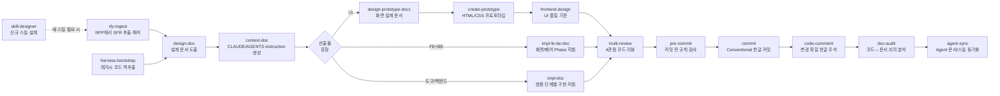
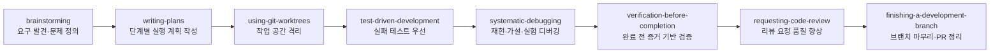
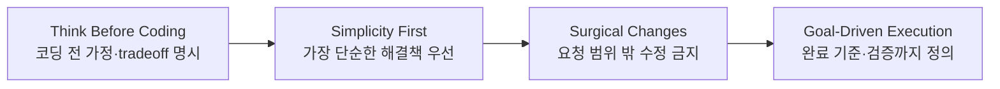
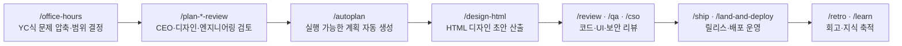
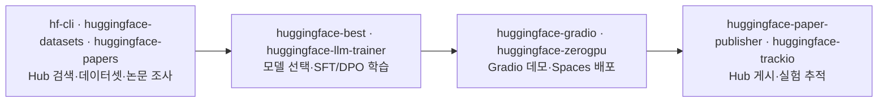

# 외부 Agent Skills 레포지토리 구성 분석

> 작성일: 2026-05-27
>
> 목적: 현재 저장소의 스킬 개선이나 신규 스킬 설계로 넘어가기 전에, 주요 공식/비공식 Agent Skills 레포지토리의 실제 구성, 설치 방식, 스킬 배치 방식, 개별 스킬 목록을 먼저 파악한다.
>
> 이 문서는 1차 구조 분석 문서다. 현재 저장소의 개선안, 신규 도입 후보, `skill-designer` v2 설계 기준은 후속 문서에서 다룬다.

---


## 목차

- [1. 공식 환경 Skill/Plugin 설치 및 적용 기본](#1-공식-환경-skillplugin-설치-및-적용-기본)
  - [1-1. Codex 스킬 폴더 배치](#1-1-codex-스킬-폴더-배치)
  - [1-2. 전역 설치와 프로젝트 루트 설치](#1-2-전역-설치와-프로젝트-루트-설치)
  - [1-3. Claude Code 스킬/플러그인 배치](#1-3-claude-code-스킬플러그인-배치)
  - [1-4. Claude Code subagent 배치](#1-4-claude-code-subagent-배치)
  - [1-5. Plugin과 직접 폴더 설치의 차이](#1-5-plugin과-직접-폴더-설치의-차이)
- [2. 비공식 스킬·서브에이전트 레포 개요](#2-비공식-스킬서브에이전트-레포-개요)
  - [2-1. 분석 대상 요약](#2-1-분석-대상-요약)
  - [2-2. 비공식 레포 한 줄 카드](#2-2-비공식-레포-한-줄-카드)
  - [2-3. 성격 분류](#2-3-성격-분류)
  - [2-4. 내부 skills와 외부 중복 매트릭스](#2-4-내부-skills와-외부-중복-매트릭스)
  - [2-5. 워크플로우 요약](#2-5-워크플로우-요약)
    - [2-5-1. 본 저장소 skills/ 16개](#2-5-1-본-저장소-skills-16개)
    - [2-5-2. obra/superpowers](#2-5-2-obrasuperpowers)
    - [2-5-3. multica-ai/andrej-karpathy-skills](#2-5-3-multica-aiandrej-karpathy-skills)
    - [2-5-4. garrytan/gstack](#2-5-4-garrytangstack)
    - [2-5-5. VoltAgent/awesome-claude-code-subagents](#2-5-5-voltagentawesome-claude-code-subagents)
    - [2-5-6. huggingface/skills](#2-5-6-huggingfaceskills)
  - [2-6. 통합 권장](#2-6-통합-권장)
- [3. 비공식 스킬 레포 상세](#3-비공식-스킬-레포-상세)
  - [3-1. obra/superpowers](#3-1-obrasuperpowers)
  - [3-2. multica-ai/andrej-karpathy-skills](#3-2-multica-aiandrej-karpathy-skills)
  - [3-3. garrytan/gstack](#3-3-garrytangstack)
  - [3-4. VoltAgent/awesome-claude-code-subagents](#3-4-voltagentawesome-claude-code-subagents)
- [4. 공식 Skill/Plugin 개요](#4-공식-skillplugin-개요)
  - [4-1. 공식 자원 분류 표](#4-1-공식-자원-분류-표)
- [5. 공식 Skill/Plugin 상세](#5-공식-skillplugin-상세)
  - [5-1. anthropics/skills](#5-1-anthropicsskills)
  - [5-2. openai/skills](#5-2-openaiskills)
  - [5-3. huggingface/skills](#5-3-huggingfaceskills)
- [6. 레포별 구성 방식 비교](#6-레포별-구성-방식-비교)
- [7. 현재 단계에서 남겨둘 메모](#7-현재-단계에서-남겨둘-메모)

## 1. 공식 환경 Skill/Plugin 설치 및 적용 기본

Agent Skills 계열 레포는 여러 방식으로 설치/사용된다.

| 방식 | 대표 경로/명령 | 적합한 경우 | 비고 |
|------|----------------|-------------|------|
| Codex 로컬 스킬 폴더 | `$REPO_ROOT/.agents/skills`, `$HOME/.agents/skills` | 특정 저장소 또는 개인 환경에 직접 스킬을 넣어 쓸 때 | `SKILL.md`가 들어 있는 폴더 단위로 배치한다. 심볼릭 링크도 가능하다. |
| Codex skill installer | `$skill-installer <skill-name>` | OpenAI curated skills 또는 GitHub의 특정 skill folder를 설치할 때 | 설치 후 Codex가 자동 감지하지 못하면 재시작한다. |
| Codex plugin | Codex App/CLI의 Plugins UI 또는 `/plugins` | 여러 스킬, 앱 연동, MCP 설정을 묶어 배포할 때 | 재사용 배포 단위로 적합하다. |
| Claude Code plugin | `/plugin marketplace add ...`, `/plugin install ...` | Claude Code marketplace/plugin 형식으로 설치할 때 | `.claude-plugin/` 매니페스트가 있는 레포에서 주로 사용한다. |
| Claude Code 직접 설치 | `~/.claude/skills/{name}` | 플러그인 대신 skills 디렉토리에 직접 clone/copy할 때 | gstack처럼 setup script가 후처리를 담당하는 경우가 있다. |
| Claude Code subagent | `.claude/agents`, `~/.claude/agents` | skill이 아니라 subagent persona/tool 권한을 추가할 때 | VoltAgent 계열은 이 방식이 중심이다. |
| Cursor/Gemini 기타 호스트 | `.cursor-plugin`, `.cursor/rules`, `gemini-extension.json` | Codex/Claude 외 환경에도 같은 지침을 배포할 때 | 레포별 지원 여부가 다르다. |

Claude Code와 Codex는 각각 인앱과 CLI 표면이 있지만, skill/plugin의 핵심 배치 원칙은 동일하게 잡는다. 인앱은 plugin directory나 UI 선택 흐름을 제공하고, CLI는 slash command나 명령어로 같은 설치 흐름을 수행한다.

| 호스트 | 전역 설치 경로 | 프로젝트 단위 설치 경로 | plugin marketplace 추가/설치 | 호출 방식 |
|--------|----------------|-------------------------|------------------------------|-----------|
| Claude Code 인앱 | `~/.claude/skills/{skill-name}` | `$REPO_ROOT/.claude/skills/{skill-name}` | `/plugin marketplace add owner/repo` 후 `/plugin install name@marketplace` | `description` 기반 자동 트리거 또는 `$skill-name`, slash command, plugin UI |
| Claude Code CLI | `~/.claude/skills/{skill-name}` | `$REPO_ROOT/.claude/skills/{skill-name}` | `claude plugin marketplace add owner/repo` 후 `claude plugin install name` | CLI 안에서 slash command 또는 명시 지시 |
| Codex App | `$HOME/.agents/skills/{skill-name}` 또는 plugin 설치 캐시 | `$REPO_ROOT/.agents/skills/{skill-name}` | Plugins UI에서 marketplace/plugin 설치 | `description` 기반 자동 트리거 또는 `$skill-name`, `/skills`, plugin UI |
| Codex CLI | `$HOME/.agents/skills/{skill-name}` | `$REPO_ROOT/.agents/skills/{skill-name}` | `/plugins` 또는 Codex plugin marketplace 명령 | `description` 기반 자동 트리거 또는 `$skill-name`, `/skills` |

`SKILL.md` 자동 트리거는 사용자의 요청이 frontmatter의 `description`과 맞을 때 agent가 스스로 선택하는 방식이다. 수동 호출은 사용자가 `$skill-name`, `/skills`, slash command, 또는 plugin UI로 특정 skill을 직접 지정하는 방식이다. 반복 업무는 자동 트리거가 잘 되도록 description을 좁게 쓰고, 중요한 작업에서는 수동 호출로 의도를 분명히 한다.

### 1-1. Codex 스킬 폴더 배치

Codex의 직접 설치 방식은 `SKILL.md`가 들어 있는 스킬 폴더를 `.agents/skills` 아래에 두는 방식이다.

```text
my-repo/
└── .agents/
    └── skills/
        └── my-skill/
            ├── SKILL.md
            ├── scripts/
            ├── references/
            └── assets/
```

대표 위치는 다음과 같다.

| 범위 | 위치 | 용도 |
|------|------|------|
| 현재 작업 디렉토리 | `$CWD/.agents/skills` | 하위 모듈/작업 폴더 전용 스킬 |
| 저장소 루트 | `$REPO_ROOT/.agents/skills` | 팀이 저장소에 함께 넣어 쓰는 스킬 |
| 개인 전역 | `$HOME/.agents/skills` | 사용자가 모든 프로젝트에서 쓰는 개인 스킬 |

Codex는 skill의 `name`, `description`, 경로를 먼저 보고, 사용자가 명시적으로 호출하거나 작업이 description과 맞으면 `SKILL.md` 전체를 읽는다. 명시 호출은 `$skill-name` 또는 `/skills` 선택 흐름을 쓴다.

### 1-2. 전역 설치와 프로젝트 루트 설치

Codex와 Claude Code 모두 "스킬 파일을 어디에 두는가"와 "스킬이 어느 프로젝트를 대상으로 실행되는가"를 분리해서 봐야 한다.

| 구분 | Codex App/CLI | Claude Code 인앱/CLI | 적용 범위 |
|------|---------------|----------------------|-----------|
| 사용자 전역 | `$HOME/.agents/skills/{skill-name}` | `$HOME/.claude/skills/{skill-name}` | 같은 사용자 계정으로 여는 모든 프로젝트에서 발견 가능 |
| 프로젝트 루트 | `$REPO_ROOT/.agents/skills/{skill-name}` | `$REPO_ROOT/.claude/skills/{skill-name}` | 해당 저장소에서만 발견 가능 |
| 실행 대상 | 현재 Codex 세션의 CWD/repo | 현재 Claude Code 세션의 CWD/repo | 전역 설치된 스킬도 실행 시에는 현재 프로젝트를 기준으로 파일, git diff, 테스트를 본다 |

전역 설치는 개인 생산성 도구처럼 여러 프로젝트에서 재사용할 때 적합하다. 프로젝트 루트 설치는 팀 저장소에 스킬을 체크인해 같은 규칙을 공유하거나, 특정 프로젝트에만 강한 워크플로우를 적용할 때 적합하다.

GitHub 레포를 직접 clone해서 설치하는 스킬은 다음 방식으로 운영한다.

```text
# 전역 Codex
$HOME/.agents/skills/{skill-name}

# 전역 Claude Code
$HOME/.claude/skills/{skill-name}

# 프로젝트 전용 Codex
$REPO_ROOT/.agents/skills/{skill-name}

# 프로젝트 전용 Claude Code
$REPO_ROOT/.claude/skills/{skill-name}
```

단, gstack처럼 자체 `setup` script가 host별 산출물을 생성하는 레포는 원본 폴더를 단순 복사하지 말고 해당 레포가 안내하는 `setup`을 다시 실행해 적용한다.

### 1-3. Claude Code 스킬/플러그인 배치

Claude Code는 레포가 `.claude-plugin/`을 제공하면 plugin marketplace 방식으로 설치하는 흐름이 일반적이다.

```text
/plugin marketplace add owner/repo
/plugin install skill-or-plugin-name@marketplace-name
```

직접 설치형 레포는 `~/.claude/skills/{repo-or-skill}` 아래에 clone/copy한 뒤, 레포가 제공하는 setup script나 `CLAUDE.md` 지침을 적용한다.

```text
~/.claude/
└── skills/
    └── gstack/
        ├── SKILL.md
        ├── setup
        └── ...
```

### 1-4. Claude Code subagent 배치

Subagent는 일반 Agent Skill과 다르다. `SKILL.md` 폴더가 아니라 agent markdown 파일을 `.claude/agents`에 둔다.

```text
my-repo/
└── .claude/
    └── agents/
        └── code-reviewer.md

~/.claude/
└── agents/
    └── code-reviewer.md
```

프로젝트 전용 `.claude/agents`가 전역 `~/.claude/agents`보다 우선한다. 사용 시에는 "Use the code-reviewer agent"처럼 agent 이름을 직접 말하거나, Claude Code가 task에 맞춰 subagent를 선택하게 한다.

### 1-5. Plugin과 직접 폴더 설치의 차이

| 항목 | 직접 폴더 설치 | Plugin 설치 |
|------|----------------|-------------|
| 단위 | 단일 skill 폴더 또는 subagent 파일 | 여러 skills, 앱, MCP, assets 묶음 |
| 배포 | repo/user/admin 디렉토리에 copy/symlink | marketplace 또는 in-app plugin install |
| 적합한 경우 | 팀 저장소 전용 규칙, 빠른 실험 | 외부 배포, 재사용 가능한 스킬 묶음 |
| 업데이트 | git pull, 파일 교체, symlink 갱신 | plugin update 또는 marketplace 재설치 |
| 예시 | `$REPO_ROOT/.agents/skills/my-skill` | `superpowers`, `huggingface/skills`, `openai/plugins` |

직접 폴더 설치한 GitHub 기반 스킬은 원본 레포가 업데이트되면 설치 위치에서 `git pull --ff-only` 후 필요한 후처리를 다시 수행한다. 일반 `SKILL.md` 스킬은 pull만으로 충분한 경우가 많지만, setup script가 있는 레포는 pull 뒤에 `./setup` 또는 host별 `./setup --host ...`를 다시 실행한다.

---


## 2. 비공식 스킬·서브에이전트 레포 개요

본 저장소는 자체 `skills/` 디렉토리의 16개 내부 스킬을 단일 원천으로 운영한다. 외부에도 같은 의도, 즉 설계→구현→리뷰 워크플로우, 행동 규범, 역할 분리, 반복 가능한 agent 운영을 서로 다른 방식으로 풀어낸 유명 레포가 다수 존재한다. 이 섹션은 내부 스킬을 대체하기 위한 목록이 아니라, 외부 자원을 언제 보조 레이어로 써야 하는지 판단하기 위한 지도다.

### 2-1. 분석 대상 요약
#### 2-1-1. 기존 분석 대상 표

| 구분 | 레포지토리 | 접근 상태 | 성격 | 주요 스킬 위치 |
|------|------------|-----------|------|----------------|
| 공식 | [anthropics/skills](https://github.com/anthropics/skills) | 가능 | Claude Agent Skills 공식 구현/예시/스펙 | `skills/` |
| 공식 | [openai/skills](https://github.com/openai/skills) | 가능 | Codex용 Agent Skills 카탈로그 | `skills/.system`, `skills/.curated` |
| 비공식 | [obra/superpowers](https://github.com/obra/superpowers) | 가능 | 개발 방법론형 스킬 프레임워크 | `skills/` |
| 비공식 | [multica-ai/andrej-karpathy-skills](https://github.com/multica-ai/andrej-karpathy-skills) | 가능 | Karpathy 관점 기반 행동 규칙/가이드라인 | `CLAUDE.md`, `skills/karpathy-guidelines` |
| 비공식 | [garrytan/gstack](https://github.com/garrytan/gstack) | 가능 | 역할 기반 Claude Code 운영 스택 | 루트 slash-command 디렉토리들 |
| 기업 공개 | [huggingface/skills](https://github.com/huggingface/skills) | 가능 | Hugging Face/AI-ML 작업용 스킬 모음 | `skills/` |
| 비공식 | [VoltAgent/awesome-claude-code-subagents](https://github.com/VoltAgent/awesome-claude-code-subagents) | 가능 | Claude Code subagent 카탈로그 | `categories/`, `.claude/agents` |

---

### 2-2. 비공식 레포 한 줄 카드

| 레포 | 만든사람 | GitHub 스타 수 | 핵심 의도 | 한 줄 요약 |
|------|----------|----------------|-----------|------------|
| [obra/superpowers](https://github.com/obra/superpowers) | Jesse Vincent / obra | 약 218k (2026-06-05 확인) | 개발 방법론을 skill workflow로 강제 | brainstorm→plan→TDD→review→finish를 agent가 빠뜨리지 않게 하는 프로세스 스택 |
| [multica-ai/andrej-karpathy-skills](https://github.com/multica-ai/andrej-karpathy-skills) | Forrest Chang (`forrestchang`) 원작 / `multica-ai` 현 유지 | 약 168k (2026-06-05 확인) | LLM 코딩 실패 패턴을 행동 원칙으로 교정 | Think Before Coding, Simplicity First, Surgical Changes, Goal-Driven Execution 네 원칙 |
| [garrytan/gstack](https://github.com/garrytan/gstack) | Garry Tan | 약 107k (2026-06-05 확인) | Claude/Codex를 가상 제품 개발 팀처럼 운영 | CEO, design, eng review, QA, ship, CSO 역할을 slash command/skill로 제공 |
| [VoltAgent/awesome-claude-code-subagents](https://github.com/VoltAgent/awesome-claude-code-subagents) | VoltAgent | 약 21.2k (2026-06-05 확인) | 역할별 Claude Code subagent 카탈로그 | 언어/인프라/보안/데이터/제품 역할을 `.claude/agents` 또는 plugin으로 설치 |

### 2-3. 성격 분류

| 대상 | 산출물형/행동형 | 워크플로우형/역할형 | 분류 근거 | 본 저장소와의 관계 |
|------|----------------|---------------------|-----------|-------------------|
| `본 저장소 skills/` | 산출물형 + 행동형 | 워크플로우형 | 설계 문서, 컨텍스트 문서, 구현 지침서, 리뷰 결과를 산출하면서 agent 행동 순서도 규정 | 기준 SoT |
| `obra/superpowers` | 행동형 | 워크플로우형 | TDD, debugging, verification, branch finishing 같은 절차 준수에 초점 | 내부 구현/검증 게이트의 보조 규율 |
| `multica-ai/andrej-karpathy-skills` | 행동형 | 워크플로우형 | 코딩 전 사고, 단순성, 범위 제한, 성공 기준을 규정 | 모든 내부 스킬에 직교하는 행동 규범 |
| `garrytan/gstack` | 행동형 | 역할형 + 워크플로우형 | CEO, designer, reviewer, QA, ship 같은 역할 명령으로 제품 개발 단계를 분리 | 역할 기반 검토가 필요한 때 보조 호출 |
| `VoltAgent/awesome-claude-code-subagents` | 행동형 | 역할형 | `.claude/agents` 기반 전문가 persona와 tool 권한 분리 | 내부 `multi-review`의 병렬 관점 확장 후보 |
| `huggingface/skills` | 산출물형 | 워크플로우형 | AI/ML, Hub, datasets, Gradio, fine-tuning 작업을 skill 단위로 분리 | AI/ML 도메인 작업 때 외부 도메인 skill로 보조 |

### 2-4. 내부 skills와 외부 중복 매트릭스

| 내부 스킬 | 대응 외부 | 겹침 정도 | 처리 권장 |
|-----------|-----------|-----------|-----------|
| `design-doc` | `superpowers`의 `brainstorming` | 상 | 내부 `design-doc`를 SoT로 두고, 요구가 모호하거나 설계 승인 루프가 필요하면 `brainstorming` 원칙을 보조 적용 |
| `impl-doc` / `impl-fe-be-doc` | `superpowers`의 `writing-plans` + `executing-plans` | 상 | 내부 구현 지침서 포맷을 우선하고, task granularity와 TDD 단계는 superpowers 패턴을 참고 |
| `multi-review` | `superpowers`의 `requesting-code-review`, Claude Code `/code-review` | 중 | 내부 4관점 리뷰를 기본으로 두고, PR 전 최종 리뷰나 외부 reviewer prompt가 필요할 때 보조 사용 |
| `pre-commit` | `superpowers`의 `verification-before-completion` | 중 | 내부 pre-commit 체크리스트를 우선하고, 완료 주장 전 증거 기반 검증 원칙을 항상 병행 |
| `commit` | Claude Code 기본 commit 흐름 | 하 | 내부 conventional commit 규칙과 한글 body 정책을 우선하고, 도구 기본 commit은 실행 수단으로만 사용 |
| 행동 규범 전체 | Karpathy 4원칙 | 중(직교) | 내부 스킬을 대체하지 말고 모든 작업에 Think/Simplicity/Surgical/Goal 기준을 덧씌움 |
| 역할 분리 | `gstack`, `awesome-claude-code-subagents` | 중 | 내부 `multi-review`, `impl-fe-be-doc` 역할 분리를 우선하고, 더 강한 persona 분리가 필요할 때 외부 역할형 도구 호출 |
| `rfp-ingest` | 직접 대응 없음 | 하 | RFP/SFR 도메인 특화는 내부 스킬 유지. 외부는 설계 리뷰 단계에서만 보조 |
| `context-doc` | 직접 대응 없음, `superpowers` plan handoff와 일부 유사 | 하 | 내부 `CLAUDE.md`/`AGENTS.md`/`.instruction` 생성 규칙 유지 |
| `harness-bootstrap` | `superpowers`의 `brainstorming` + `writing-plans`와 일부 유사 | 중 | 기존 코드베이스 역추출은 내부 스킬 우선. 외부는 분해/검증 패턴만 참고 |
| `design-prototype-docs` | `anthropics/skills`의 `frontend-design`, `web-artifacts-builder` | 중 | 내부 목업 문서 포맷 우선, 시각 품질 기준은 외부 디자인 스킬 참고 가능 |
| `create-prototype` | `anthropics/skills`의 `web-artifacts-builder`, gstack `/design-html` | 중 | 내부 산출물 경로/JSON 규칙 우선, 대안 디자인 생성은 외부 보조 |
| `frontend-design` | `anthropics/skills`의 `frontend-design`, gstack `/design-review` | 중 | 내부 UI 품질 기준 우선, 완성 화면 리뷰에는 외부 디자인 리뷰 보조 가능 |
| `code-comment` | 직접 대응 없음 | 하 | 한글 주석 작성·갱신 정책은 내부 전용으로 유지 |
| `doc-audit` | `superpowers`의 verification/review 원칙과 일부 유사 | 하 | 코드와 agent 문서 괴리 분석은 내부 스킬 우선 |
| `agent-sync` | 직접 대응 없음 | 하 | `skills/` SoT와 설치 대상 동기화는 내부 운영 스킬로 유지 |
| `skill-designer` | `skill-creator`, `writing-skills` | 상 | 내부 스킬 설계 품질 기준을 우선하고, 표준 Agent Skills 구조 검증에는 외부 메타 스킬 참고 |

### 2-5. 워크플로우 요약

레포별로 호출 순서가 다르므로 하나의 큰 그림 대신 **레포마다 독립된 다이어그램**으로 분리한다. 각 노드는 `스킬명 / 한글 역할` 형식으로 표기한다.

#### 2-5-1. 본 저장소 `skills/` 16개

설계 → 컨텍스트 → (선택) 프로토타입 → 구현 → 리뷰/품질 게이트 → 커밋 → 문서 동기화로 이어지는 산출물 파이프라인이다.



#### 2-5-2. obra/superpowers

방법론 강제형 — 발견 → 계획 → 격리 → TDD/디버깅 → 검증 → 리뷰 → 마무리.



#### 2-5-3. multica-ai/andrej-karpathy-skills

행동 규범형 — 모든 작업 위에 얹는 4원칙. 순서라기보다는 항상 동시에 작동하는 가드.



#### 2-5-4. garrytan/gstack

가상 제품 팀형 — 아이디어 압축부터 배포·회고까지 역할 페르소나 슬래시 커맨드로 분리.



#### 2-5-5. VoltAgent/awesome-claude-code-subagents

역할 카탈로그형 — 메인 에이전트가 작업에 맞는 전문 subagent를 골라 위임한다.


#### 2-5-6. huggingface/skills

AI/ML 도메인형 — 탐색 → 모델 선택/학습 → 데모 배포 → Hub 게시·추적.



### 2-6. 통합 권장

우선순위는 `사용자 직접 지시 > 본 저장소 내부 skills/ > Karpathy 4원칙 > 그 외 외부 스킬/플러그인`으로 둔다. 내부 `skills/`는 이 저장소의 산출물 형식과 운영 흐름을 정의하는 SoT이고, Karpathy 원칙은 모든 작업에 적용되는 행동 안전장치다. `superpowers`, `gstack`, `awesome-claude-code-subagents`, `huggingface/skills`는 내부 스킬을 대체하지 않고, 블록 3의 각 레포 절에 정리된 호출 시점에서만 보조 계층으로 쓴다.

## 3. 비공식 스킬 레포 상세

### 3-1. obra/superpowers

#### 3-1-1. 접근 링크

- GitHub: [https://github.com/obra/superpowers](https://github.com/obra/superpowers)
- Skills 디렉토리: [https://github.com/obra/superpowers/tree/main/skills](https://github.com/obra/superpowers/tree/main/skills)

#### 3-1-2. 레포 성격

Superpowers는 단순 스킬 모음이 아니라, coding agent가 설계, 계획, 구현, 검증, 리뷰를 순서 있게 수행하도록 만드는 개발 방법론형 스킬 프레임워크다.

README 기준 핵심 흐름은 다음과 같다.

1. 바로 코딩하지 않고 사용자가 진짜 만들려는 것을 먼저 묻는다.
2. 대화에서 spec을 끌어낸다.
3. 읽을 수 있는 작은 단위로 설계를 확인시킨다.
4. 승인 후 구현 계획을 만든다.
5. TDD, YAGNI, DRY를 강조한다.
6. subagent-driven development로 작업을 수행하고 검토한다.

#### 3-1-3. top-level 구조

```text
obra/superpowers
├── .claude-plugin/
├── .codex-plugin/
├── .cursor-plugin/
├── .github/
├── .opencode/
├── assets/
├── docs/
├── hooks/
├── scripts/
├── skills/
├── tests/
├── AGENTS.md
├── CLAUDE.md
├── GEMINI.md
├── README.md
├── RELEASE-NOTES.md
├── gemini-extension.json
└── package.json
```

#### 3-1-4. 스킬 위치

핵심 스킬은 `skills/{skill-name}/SKILL.md`에 있다. 동시에 `.claude-plugin`, `.codex-plugin`, `.cursor-plugin`, `.opencode`, `AGENTS.md`, `CLAUDE.md`, `GEMINI.md`를 통해 여러 harness에 같은 방법론을 배포한다.

#### 3-1-5. 설치/사용 방법

Claude Code 공식 marketplace:

```text
/plugin install superpowers@claude-plugins-official
```

Superpowers marketplace:

```text
/plugin marketplace add obra/superpowers-marketplace
/plugin install superpowers@superpowers-marketplace
```

Codex CLI:

```text
/plugins
```

그 뒤 `superpowers`를 검색해서 설치한다.

Codex App에서는 Plugins 사이드바에서 `Superpowers`를 찾아 설치한다.

직접 폴더 설치를 할 경우에는 plugin 설치 대신 `skills/` 하위 개별 skill 폴더를 agent별 skills 경로에 복사할 수 있다.

```text
$REPO_ROOT/.agents/skills/test-driven-development/
$HOME/.agents/skills/writing-plans/
~/.claude/skills/superpowers/
```

설치 방식 요약:

| 방식 | 지원 여부 | 사용법 |
|------|-----------|--------|
| Claude Code 공식 plugin | 지원 | `/plugin install superpowers@claude-plugins-official` |
| Superpowers marketplace | 지원 | `/plugin marketplace add obra/superpowers-marketplace` 후 install |
| Codex App in-app plugin | 지원 | Plugins 사이드바에서 `Superpowers` 검색 후 설치 |
| Codex CLI plugin | 지원 | `/plugins`에서 `superpowers` 검색 |
| Codex `.agents/skills` 직접 배치 | 가능 | `skills/{skill}` 폴더를 `.agents/skills` 아래에 복사/symlink |
| Claude 직접 skills 폴더 | 가능 | `~/.claude/skills` 아래에 clone/copy |

사용 방식은 자연어 지시와 스킬명 직접 호출이 모두 가능하다. 예를 들어 `Use the test-driven-development skill`, `writing-plans를 사용해서 구현 계획 작성`, `Superpowers 방식으로 먼저 brainstorming`처럼 지시한다.

#### 3-1-6. 개별 스킬 목록

`skills/`에서 확인되는 스킬은 다음과 같다.

| 스킬 | 역할 요약 |
|------|-----------|
| `brainstorming` | 사용자가 처음 말한 기능명을 그대로 구현하지 않고, 실제 문제와 목표를 대화로 파고든다. 요구사항이 흐릿하거나 제품 방향을 먼저 잡아야 할 때 시작점으로 쓰인다. |
| `dispatching-parallel-agents` | 서로 독립적인 조사/검토/구현 작업을 여러 subagent에게 나눠 맡기는 방법을 안내한다. 큰 작업을 빠르게 탐색하거나 여러 관점 리뷰를 병렬화할 때 사용한다. |
| `executing-plans` | 이미 승인된 계획을 실제 코드 변경으로 옮기는 실행 스킬이다. 계획 밖으로 벗어나지 않고 단계별로 구현, 검증, 보고하도록 agent를 묶어준다. |
| `finishing-a-development-branch` | 개발 브랜치를 마무리하기 전에 남은 변경, 테스트, 문서, 커밋 상태를 정리한다. PR을 올리기 전 마지막 점검 흐름에 해당한다. |
| `receiving-code-review` | 받은 리뷰 코멘트를 해석하고, 어떤 것은 수정하고 어떤 것은 질문/반박할지 정리한다. 리뷰를 무조건 수용하지 않고 의도를 파악해 반영하게 만든다. |
| `requesting-code-review` | 변경 사항을 리뷰하기 좋은 형태로 설명하고, reviewer가 봐야 할 위험 지점과 검증 방법을 정리한다. PR 설명이나 리뷰 요청 메시지 품질을 높이는 스킬이다. |
| `subagent-driven-development` | 구현, 테스트, 리뷰 같은 하위 작업을 subagent에게 맡기고 조율하는 개발 방식이다. 한 agent가 모든 맥락을 들고 가기보다 역할별로 작업을 나눌 때 사용한다. |
| `systematic-debugging` | 증상만 보고 추측으로 고치지 않고, 재현, 관찰, 가설, 실험, 검증 순서로 버그를 좁혀간다. 원인이 불명확한 장애나 회귀 버그에 적합하다. |
| `test-driven-development` | 먼저 실패하는 테스트를 만들고, 최소 구현으로 통과시킨 뒤 리팩터링하는 TDD 흐름을 강제한다. 동작 계약이 분명한 로직, API, 버그 수정에 특히 유용하다. |
| `using-git-worktrees` | Git worktree로 여러 브랜치/작업 공간을 분리해 병렬 개발하는 방법을 안내한다. 동시에 여러 실험이나 PR 작업을 진행할 때 작업 디렉토리 충돌을 줄인다. |
| `using-superpowers` | Superpowers 스킬 세트를 언제, 어떤 순서로 써야 하는지 알려주는 입문/라우팅 스킬이다. Superpowers 자체의 사용 설명서 역할을 한다. |
| `verification-before-completion` | 작업이 끝났다고 말하기 전에 실제 테스트, 빌드, 수동 확인을 수행하도록 강제한다. "구현했다"와 "검증됐다"를 분리하는 완료 전 게이트다. |
| `writing-plans` | 구현 전에 읽기 쉬운 단계별 계획을 작성한다. 범위, 파일, 검증 방법, 위험 요소를 먼저 정리해 사용자의 승인을 받는 데 초점이 있다. |
| `writing-skills` | 새로운 Superpowers/Agent Skill을 작성하는 방법을 안내한다. 반복 가능한 workflow를 `SKILL.md`와 보조 파일로 패키징할 때 사용한다. |

#### 3-1-7. 스킬 분류 관점

Superpowers는 산출물보다 개발 프로세스 단계에 따라 스킬을 나눈다.

- 발견/정의: `brainstorming`
- 계획: `writing-plans`
- 실행: `executing-plans`, `subagent-driven-development`
- 검증: `test-driven-development`, `verification-before-completion`
- 리뷰: `requesting-code-review`, `receiving-code-review`
- 운영: `using-git-worktrees`, `finishing-a-development-branch`
- 메타: `using-superpowers`, `writing-skills`

---


> **본 저장소 skills/와의 관계:** `design-doc`은 `brainstorming`, `impl-doc`/`impl-fe-be-doc`는 `writing-plans`/`executing-plans`, `pre-commit`은 `verification-before-completion`과 겹친다. 내부 산출물 포맷을 우선하고, superpowers는 task granularity, TDD, 완료 검증 discipline 보강에 사용한다.

### 3-2. multica-ai/andrej-karpathy-skills

#### 3-2-1. 접근 링크

- GitHub: [https://github.com/multica-ai/andrej-karpathy-skills](https://github.com/multica-ai/andrej-karpathy-skills)
- 기존 URL `forrestchang/andrej-karpathy-skills`는 현재 `multica-ai/andrej-karpathy-skills`로 리다이렉트된다.

#### 3-2-2. 레포 성격

Karpathy가 지적한 LLM coding agent의 실패 패턴을 `CLAUDE.md`, Cursor rule, Agent Skill 형태로 패키징한 얇은 행동 규칙 레포다.

핵심은 대규모 스킬 카탈로그가 아니라 네 가지 원칙이다.

1. Think Before Coding
2. Simplicity First
3. Surgical Changes
4. Goal-Driven Execution

#### 3-2-3. top-level 구조

```text
multica-ai/andrej-karpathy-skills
├── .claude-plugin/
├── .cursor/
│   └── rules/
├── skills/
│   └── karpathy-guidelines/
├── CLAUDE.md
├── CURSOR.md
├── EXAMPLES.md
├── README.md
└── README.zh.md
```

#### 3-2-4. 스킬 위치

핵심 지침은 다음 세 위치에 중복 제공된다.

- `CLAUDE.md`: Claude Code 프로젝트 규칙
- `.cursor/rules/karpathy-guidelines.mdc`: Cursor 규칙
- `skills/karpathy-guidelines/SKILL.md`: Agent Skills 형식

#### 3-2-5. 설치/사용 방법

Claude Code plugin 방식:

```text
/plugin marketplace add forrestchang/andrej-karpathy-skills
/plugin install andrej-karpathy-skills@karpathy-skills
```

프로젝트 단위 `CLAUDE.md` 다운로드:

```text
curl -o CLAUDE.md https://raw.githubusercontent.com/forrestchang/andrej-karpathy-skills/main/CLAUDE.md
```

기존 `CLAUDE.md`에 append:

```text
echo "" >> CLAUDE.md
curl https://raw.githubusercontent.com/forrestchang/andrej-karpathy-skills/main/CLAUDE.md >> CLAUDE.md
```

직접 설치 경로 관점에서는 다음 세 방식이 핵심이다.

```text
project/
├── CLAUDE.md
├── .cursor/
│   └── rules/
│       └── karpathy-guidelines.mdc
└── .agents/
    └── skills/
        └── karpathy-guidelines/
            └── SKILL.md
```

설치 방식 요약:

| 방식 | 지원 여부 | 사용법 |
|------|-----------|--------|
| Claude Code plugin | 지원 | `/plugin marketplace add ...` 후 `/plugin install ...` |
| `CLAUDE.md` 직접 삽입 | 지원 | 레포의 `CLAUDE.md`를 프로젝트 `CLAUDE.md`로 복사/append |
| Cursor rule | 지원 | `.cursor/rules/karpathy-guidelines.mdc` 배치 |
| Codex `.agents/skills` | 가능 | `skills/karpathy-guidelines`를 `.agents/skills` 아래 복사 |
| 단일 파일 규칙 | 가능 | 핵심 원칙만 `AGENTS.md`, `CLAUDE.md`, 프로젝트 rule 문서에 이식 |

사용 방식은 "Karpathy guidelines를 적용해서 구현", "Surgical Changes 기준으로 수정 범위 제한"처럼 원칙명을 직접 언급하는 형태가 가장 명확하다.

#### 3-2-6. 개별 스킬/원칙 목록

이 레포는 여러 기능 스킬을 제공하기보다 하나의 guidelines skill을 제공한다.

| 항목 | 역할 요약 |
|------|-----------|
| `karpathy-guidelines` | LLM coding agent가 성급하게 코드를 만들거나, 과하게 설계하거나, 요청 범위를 벗어나는 문제를 줄이기 위한 행동 규칙 묶음이다. 작은 수정, 명확한 목표, 검증 가능한 완료 기준을 강조한다. |
| `Think Before Coding` | 구현 전에 모르는 점, 가정, 선택지, tradeoff를 먼저 드러내라는 원칙이다. 요구사항이 애매한데도 바로 코드를 쓰는 행동을 막기 위한 규칙이다. |
| `Simplicity First` | 지금 필요한 가장 단순한 해결책을 우선하라는 원칙이다. 미래 확장성을 이유로 불필요한 추상화, 프레임워크, 복잡한 구조를 추가하지 않게 한다. |
| `Surgical Changes` | 요청받은 범위의 파일과 동작만 정확히 바꾸라는 원칙이다. 관련 없는 리팩터링, 포맷 변경, 주석 정리, 대규모 구조 변경을 방지한다. |
| `Goal-Driven Execution` | 작업을 "무엇을 바꿀지"가 아니라 "어떤 성공 기준을 만족해야 끝나는지"로 정의한다. 구현 후 테스트나 확인 절차까지 포함해 완료 여부를 검증하게 한다. |

#### 3-2-7. 스킬 분류 관점

분류 기준은 기능 영역이 아니라 agent 행동 실패 패턴이다.

- 잘못된 가정 방지
- 과잉 설계 방지
- 무관한 코드 변경 방지
- 성공 기준과 검증 루프 강제

---


> **본 저장소 skills/와의 관계:** Karpathy 4원칙은 특정 내부 스킬의 대체물이 아니라 전체 내부 workflow에 직교하는 행동 규범이다. 특히 `impl-*`, `multi-review`, `pre-commit` 수행 중 과잉 구현과 범위 이탈을 줄이는 기본 가드레일로 둔다.

### 3-3. garrytan/gstack

#### 3-3-1. 접근 링크

- GitHub: [https://github.com/garrytan/gstack](https://github.com/garrytan/gstack)

#### 3-3-2. 레포 성격

GStack은 Claude Code를 "가상 엔지니어링 팀"처럼 쓰기 위한 역할 기반 slash command/skill 스택이다. README 기준으로 CEO, engineering manager, designer, reviewer, QA lead, security officer, release engineer 같은 역할을 명시한다.

일반적인 `skills/` 단일 디렉토리 구조가 아니라, 루트에 slash command 성격의 디렉토리와 도구가 대량 배치된 구조다.

#### 3-3-3. top-level 구조

확인되는 주요 top-level 항목은 다음과 같다.

```text
garrytan/gstack
├── .github/
├── agents/
├── autoplan/
├── benchmark-models/
├── benchmark/
├── bin/
├── browse/
├── browser-skills/
│   └── hackernews-frontpage/
├── canary/
├── careful/
├── claude/
├── codex/
├── context-restore/
├── context-save/
├── contrib/
│   └── add-host/
├── cso/
├── design-consultation/
├── design-html/
├── design-review/
├── design-shotgun/
├── design/
├── devex-review/
├── docs/
├── document-generate/
├── document-release/
├── extension/
├── freeze/
├── gstack-upgrade/
├── gstack/
├── guard/
├── health/
├── hosts/
├── investigate/
├── ios-clean/
├── ios-design-review/
├── ios-fix/
├── ios-qa/
├── ios-sync/
├── land-and-deploy/
├── landing-report/
├── learn/
├── lib/
├── make-pdf/
├── model-overlays/
├── office-hours/
├── open-gstack-browser/
├── openclaw/
├── pair-agent/
├── plan-ceo-review/
├── plan-design-review/
├── plan-devex-review/
├── plan-eng-review/
├── plan-tune/
├── qa-only/
├── qa/
├── retro/
├── review/
├── scrape/
├── scripts/
├── setup-browser-cookies/
├── setup-deploy/
├── setup-gbrain/
├── ship/
├── skillify/
├── supabase/
├── sync-gbrain/
├── test/
├── unfreeze/
├── AGENTS.md
├── ARCHITECTURE.md
├── BROWSER.md
├── CLAUDE.md
├── DESIGN.md
├── ETHOS.md
├── README.md
├── SKILL.md
├── SKILL.md.tmpl
└── package.json
```

#### 3-3-4. 스킬 위치

GStack은 `skills/` 한 곳에 모으는 대신 루트의 각 디렉토리를 slash command/skill처럼 사용한다.

예를 들어:

- `/office-hours` -> `office-hours/`
- `/plan-ceo-review` -> `plan-ceo-review/`
- `/review` -> `review/`
- `/qa` -> `qa/`
- `/ship` -> `ship/`
- `/cso` -> `cso/`

#### 3-3-5. 설치/사용 방법

GStack은 일반적인 `skills/{skill-name}/SKILL.md` 카탈로그가 아니라, 루트 레포를 clone한 뒤 `setup`이 Claude/Codex 등 host별 skill 문서를 생성하고 등록하는 방식이다. 따라서 원본 폴더를 임의로 `.agents/skills/gstack/...` 아래에 중첩 배치하지 말고, 설치 범위에 맞는 위치에서 `./setup`을 실행한다.

##### 3-3-5-1. 사용자 전역 설치

Claude Code 인앱/CLI 전역 설치:

```text
git clone --single-branch --depth 1 https://github.com/garrytan/gstack.git ~/.claude/skills/gstack
cd ~/.claude/skills/gstack
./setup
```

README는 설치 후 `CLAUDE.md`에 gstack 섹션을 추가하고, 사용 가능한 slash command 목록을 등록하라고 안내한다.

Codex App/CLI 전역 설치:

```text
git clone --single-branch --depth 1 https://github.com/garrytan/gstack.git ~/.codex/skills/gstack
cd ~/.codex/skills/gstack
./setup --host codex
```

gstack README와 `setup` script는 Codex host의 설치 원본 위치로 `~/.codex/skills/gstack`을 사용한다. Codex 최신 문서의 일반 사용자 skill discovery 위치는 `$HOME/.agents/skills`지만, gstack은 `setup --host codex`가 Codex용 산출물을 생성/등록하므로 먼저 gstack 공식 설치 흐름을 따른다. 설치 후 Codex App/CLI에서 gstack skill이 보이지 않으면 재시작하고, 그래도 보이지 않을 때만 `~/.codex/skills/gstack`의 setup 결과물을 `$HOME/.agents/skills`에 mirror 또는 symlink하는 방식을 검토한다.

전역 설치의 의미는 "모든 드라이브"가 아니라 "현재 사용자 계정 전체"다. 예를 들어 Windows에서 `~`가 `C:\Users\lhb93`이면 gstack 원본은 C 드라이브 홈에 있어도, `D:\Dev_Workspace\project-a`에서 Claude/Codex를 실행하면 현재 프로젝트인 `project-a`를 대상으로 `/review`, `/qa`, `gstack-review` 같은 흐름이 동작한다.

팀 모드:

```text
(cd ~/.claude/skills/gstack && ./setup --team) && ~/.claude/skills/gstack/bin/gstack-team-init required
```

##### 3-3-5-2. 프로젝트 루트 전용 설치

프로젝트에만 gstack을 적용하려면 해당 저장소 루트 아래에 설치한다. 이 방식은 팀 저장소에 gstack 적용 여부를 명시적으로 남기거나, 특정 프로젝트에서만 gstack 워크플로우를 강하게 적용할 때 적합하다.

Claude Code 프로젝트 전용 설치:

```text
cd $REPO_ROOT
git clone --single-branch --depth 1 https://github.com/garrytan/gstack.git .claude/skills/gstack
cd .claude/skills/gstack
./setup
```

Codex 프로젝트 전용 설치:

```text
cd $REPO_ROOT
git clone --single-branch --depth 1 https://github.com/garrytan/gstack.git .agents/skills/gstack
cd .agents/skills/gstack
./setup --host codex
```

프로젝트 전용 설치에서는 clone된 gstack 원본이 저장소 안에 들어오므로, 팀이 실제로 버전 고정해서 공유할지 여부를 먼저 정해야 한다. 공유하지 않을 개인 실험이면 `.claude/skills/gstack` 또는 `.agents/skills/gstack`을 `.gitignore`에 추가한다. 팀이 공유하려면 submodule, pinned commit, 또는 별도 문서화된 설치 절차 중 하나로 관리한다.

##### 3-3-5-3. 다른 host 대상 설치

README 기준 host별 설치 위치 예시는 다음과 같다.

| Agent | flag | 설치 위치 |
|-------|------|-----------|
| OpenAI Codex CLI | `--host codex` | `~/.codex/skills/gstack-*/` |
| OpenCode | `--host opencode` | `~/.config/opencode/skills/gstack-*/` |
| Cursor | `--host cursor` | `~/.cursor/skills/gstack-*/` |
| Factory Droid | `--host factory` | `~/.factory/skills/gstack-*/` |
| Slate | `--host slate` | `~/.slate/skills/gstack-*/` |
| Kiro | `--host kiro` | `~/.kiro/skills/gstack-*/` |
| Hermes | `--host hermes` | `~/.hermes/skills/gstack-*/` |
| GBrain | `--host gbrain` | `~/.gbrain/skills/gstack-*/` |

host를 명시해서 재생성하려면 설치 원본에서 다음처럼 실행한다.

```text
cd ~/.claude/skills/gstack
./setup --host codex

cd ~/.codex/skills/gstack
./setup --host codex
```

설치 방식 요약:

| 방식 | 지원 여부 | 사용법 |
|------|-----------|--------|
| Claude Code 전역 설치 | 지원 | `~/.claude/skills/gstack`에 clone 후 `./setup` |
| Claude Code 프로젝트 설치 | 지원 | `$REPO_ROOT/.claude/skills/gstack`에 clone 후 `./setup` |
| Claude Code team mode | 지원 | `./setup --team` 및 `gstack-team-init required/optional` |
| Codex 전역 설치 | 지원 | `~/.codex/skills/gstack`에 clone 후 `./setup --host codex` |
| Codex 프로젝트 설치 | 지원 | `$REPO_ROOT/.agents/skills/gstack`에 clone 후 `./setup --host codex` |
| 기타 host 설치 | 지원 | `--host opencode`, `--host cursor` 등 |
| in-app plugin | 레포 기준 명시적 marketplace보다 setup 중심 | Codex/Claude 환경에 따라 setup script가 host별 경로를 구성 |

##### 3-3-5-4. gstack 업데이트 후 재적용

gstack 레포가 업데이트되면 clone한 설치 원본 위치에서 최신 커밋을 가져온 뒤 setup을 다시 실행한다. gstack은 생성된 skill 문서와 host별 링크/복사 결과가 있으므로 `git pull`만 하고 끝내지 않는다.

Claude Code 전역 설치 업데이트:

```text
cd ~/.claude/skills/gstack
git pull --ff-only
./setup
```

Codex App/CLI 전역 설치 업데이트:

```text
cd ~/.codex/skills/gstack
git pull --ff-only
./setup --host codex
```

Claude Code 프로젝트 전용 설치 업데이트:

```text
cd $REPO_ROOT/.claude/skills/gstack
git pull --ff-only
./setup
```

Codex 프로젝트 전용 설치 업데이트:

```text
cd $REPO_ROOT/.agents/skills/gstack
git pull --ff-only
./setup --host codex
```

Windows에서는 symlink 생성이 제한될 수 있어 gstack setup이 copy fallback을 사용할 수 있다. 이 경우 원본 레포만 `git pull`하면 기존 복사본은 오래된 상태로 남을 수 있으므로, 업데이트 후에는 반드시 `./setup`을 다시 실행하고 Claude/Codex App 또는 CLI 세션을 재시작해 skill 목록을 새로 읽게 한다.

사용 방식은 slash command 중심이다.

```text
/office-hours
/autoplan
/review
/qa https://staging.example.com
/ship
```

OpenClaw 같은 외부 agent에서 Claude Code 세션을 spawn하는 경우에는 "Load gstack. Run /cso"처럼 세션 프롬프트에 gstack command를 직접 넣는 흐름을 사용한다.

#### 3-3-6. slash command/스킬 목록

README 설치 지침에 명시된 주요 명령은 다음과 같다.

| 명령 | 역할 요약 |
|------|-----------|
| `/office-hours` | 만들려는 제품/기능을 바로 구현하지 않고, 실제 사용자 문제와 가장 작은 출시 범위를 찾는 대화형 시작점이다. YC office hours처럼 아이디어를 압축하고 우선순위를 잡는다. |
| `/plan-ceo-review` | 기능 아이디어를 CEO/창업자 관점에서 검토한다. 시장성, 범위, 차별점, "정말 지금 만들 가치가 있는가"를 따져보는 전략 리뷰에 가깝다. |
| `/plan-eng-review` | 구현 계획을 엔지니어링 관점에서 점검한다. 아키텍처, 데이터 흐름, 실패 모드, 테스트 전략, 구현 난이도를 검토해 계획의 기술 리스크를 줄인다. |
| `/plan-design-review` | 구현 전 계획을 디자인 관점에서 본다. UX 흐름, 화면 복잡도, 정보 구조, 사용자가 헷갈릴 지점을 미리 찾는 데 초점이 있다. |
| `/design-consultation` | 특정 화면이나 제품 경험에 대해 디자인 조언을 받는 명령이다. 화면이 아직 확정되지 않았거나, 사용성/시각 방향에 대한 판단이 필요할 때 쓴다. |
| `/design-shotgun` | 하나의 요구사항에 대해 여러 디자인 방향을 빠르게 생성한다. 한 가지 안에 갇히지 않고 비교 가능한 대안을 만들 때 유용하다. |
| `/design-html` | 디자인 아이디어를 실제 HTML 형태로 산출한다. 정적인 설명보다 브라우저에서 열어볼 수 있는 UI 초안이 필요할 때 사용한다. |
| `/review` | 현재 브랜치의 변경사항을 코드 리뷰한다. 버그, 회귀, 테스트 누락, 유지보수 위험을 찾아 PR 전 품질을 높이는 명령이다. |
| `/ship` | 변경사항을 릴리스 가능한 상태로 정리한다. 테스트, PR, changelog, 배포 전 확인 등 "이제 내보내도 되는가"를 점검한다. |
| `/land-and-deploy` | 변경사항을 merge하고 배포까지 이어가는 흐름을 담당한다. 단순 commit이 아니라 실제 배포 완료까지 이어지는 release operation 성격이다. |
| `/canary` | 배포 후 일부 환경/사용자에서 문제가 없는지 확인한다. canary release나 staging smoke test처럼 조기 이상 징후를 찾는 데 사용한다. |
| `/benchmark` | 성능, 처리량, 응답시간 같은 지표를 비교 측정한다. 최적화 전후 차이를 숫자로 확인하거나 모델/구현 대안을 비교할 때 사용한다. |
| `/browse` | 웹 페이지를 열고 탐색하며 정보를 확인한다. 외부 문서, 웹앱, staging 페이지를 실제 브라우징해야 하는 작업에 쓰인다. |
| `/connect-chrome` | 로컬 Chrome 세션과 연결해 브라우저 기반 작업을 수행할 준비를 한다. 로그인 상태나 실제 사용자 세션이 필요한 QA에 유용하다. |
| `/qa` | 실제 브라우저에서 사용 흐름을 클릭하며 QA한다. 화면 렌더링, 버튼 동작, 폼 제출, 오류 상태를 사람이 테스트하듯 확인한다. |
| `/qa-only` | 구현이나 수정은 하지 않고 QA 검증만 수행한다. 이미 만들어진 기능을 독립적으로 검사하거나 릴리스 전 확인할 때 적합하다. |
| `/design-review` | 완성되었거나 진행 중인 UI를 디자인 관점에서 리뷰한다. 시각 완성도, 정보 밀도, 반응형, 사용성 문제를 찾는다. |
| `/setup-browser-cookies` | 브라우저 자동화가 로그인된 서비스를 사용할 수 있도록 쿠키/세션을 준비한다. 인증이 필요한 staging/관리자 화면 QA 전에 필요할 수 있다. |
| `/setup-deploy` | 프로젝트 배포 환경을 준비한다. 배포 대상, 환경 변수, 인증, 빌드 설정을 정리해 `/ship`이나 배포 명령이 실행될 수 있게 한다. |
| `/setup-gbrain` | GBrain 연동을 준비하는 설정 명령이다. gstack의 지식/메모리 또는 별도 도구 연동을 쓰려는 환경에서 사용한다. |
| `/retro` | 작업이나 스프린트가 끝난 뒤 회고를 수행한다. 잘된 점, 막힌 점, 다음에 자동화하거나 스킬화할 점을 정리한다. |
| `/investigate` | 장애, 버그, 이상 동작의 원인을 조사한다. 즉시 고치기보다 로그, 증상, 재현 조건, 최근 변경을 모아 원인을 좁힌다. |
| `/document-release` | 릴리스 내용을 사용자/팀이 이해할 수 있게 문서화한다. 변경 요약, 영향 범위, 마이그레이션, 주의사항을 정리한다. |
| `/document-generate` | 특정 주제나 코드 변경을 기반으로 문서를 생성한다. README, 사용법, 내부 설명서, 기술 노트 초안 작성에 사용한다. |
| `/codex` | gstack을 Codex 환경과 연결하거나 Codex 사용 흐름에 맞게 전환하는 명령이다. Claude 중심 스택을 다른 agent host에서 쓰기 위한 접점이다. |
| `/cso` | Chief Security Officer 관점으로 보안 감사를 수행한다. OWASP, STRIDE, 인증/권한, 데이터 노출, 비밀값 같은 보안 리스크를 본다. |
| `/autoplan` | 요구사항에서 구현 계획을 자동으로 만든다. 작업 범위, 단계, 파일 후보, 검증 방법을 agent가 실행 가능한 계획으로 정리한다. |
| `/plan-devex-review` | 계획 단계에서 개발자 경험을 검토한다. API 사용성, 설정 복잡도, 로컬 개발 편의성, 온보딩 문제를 미리 찾는다. |
| `/devex-review` | 이미 구현된 코드나 도구를 개발자 경험 관점에서 리뷰한다. 문서, 에러 메시지, 명령어, 설정, 확장성의 불편함을 찾는다. |
| `/careful` | 더 보수적이고 느리더라도 안전하게 작업하도록 agent의 태도를 바꾸는 명령이다. 위험한 코드 변경, 데이터 삭제, 배포 작업 전에 적합하다. |
| `/freeze` | 특정 범위의 변경을 동결한다. 릴리스 직전이나 안정화 기간에 불필요한 수정이 섞이지 않도록 guardrail을 세운다. |
| `/guard` | 위험한 변경, 금지 패턴, 범위 이탈을 막는 보호 규칙을 적용한다. agent가 작업 중 선을 넘지 않도록 제약을 강화한다. |
| `/unfreeze` | 이전에 걸어둔 변경 동결을 해제한다. 안정화/릴리스가 끝나 다시 일반 개발 모드로 돌아갈 때 사용한다. |
| `/gstack-upgrade` | 설치된 gstack을 최신 상태로 업데이트한다. 스킬, 명령, setup script가 바뀐 경우 로컬 환경을 갱신한다. |
| `/learn` | 반복적으로 얻은 지식이나 프로젝트 규칙을 학습 자료로 정리한다. 다음 작업에서 재사용할 컨텍스트를 남기는 운영 명령이다. |
| `/ios-qa` | iOS 앱을 시뮬레이터/실기기에서 실제 클릭·스와이프하며 QA한다. 화면 전환, 입력, 에러 상태를 사람이 테스트하듯 확인한다. |
| `/ios-fix` | iOS 빌드/런타임 오류와 UI 회귀를 수정한다. Xcode 로그, 시뮬레이터 동작을 보고 원인을 좁혀 수정하는 흐름이다. |
| `/ios-design-review` | iOS 화면의 디자인 완성도를 리뷰한다. iOS HIG, dynamic type, dark mode, safe area 같은 플랫폼 규약을 본다. |
| `/ios-clean` | iOS 프로젝트의 빌드 캐시, derived data, 시뮬레이터 상태를 정리한다. 재현이 어려운 빌드 오류를 끊을 때 사용한다. |
| `/ios-sync` | iOS 프로젝트의 의존성, 인증서, 설정을 최신 상태로 맞춘다. 팀원 간 환경 차이를 줄이는 운영 명령이다. |
| `/pair-agent` | 다른 agent와 짝을 이뤄 협업 세션을 구성한다. 한 agent가 구현하고 다른 agent가 검증/리뷰하는 패턴 등에 사용한다. |
| `/open-gstack-browser` | gstack 운영용 브라우저 창을 띄운다. `/connect-chrome`·`/setup-browser-cookies`와 함께 브라우저 기반 작업의 진입점이다. |
| `/spec` | 기능/요구사항에 대한 스펙 문서를 작성한다. 구현 전 합의가 필요한 인터페이스, 동작, 수용 기준을 정리한다. |
| `/context-restore` | 이전 세션의 컨텍스트나 작업 상태를 복원한다. 긴 작업을 끊었다가 이어서 진행할 때 사용한다. |
| `/sync-gbrain` | GBrain에 저장된 지식/메모리를 현재 환경과 동기화한다. `/setup-gbrain`으로 연동을 만든 뒤 주기적으로 호출한다. |

#### 3-3-7. 스킬 분류 관점

GStack은 역할과 제품 개발 운영 단계로 나눈다.

- 제품/전략: `office-hours`, `plan-ceo-review`
- 설계/엔지니어링 계획: `autoplan`, `plan-eng-review`, `plan-tune`
- 디자인: `design-*`
- 리뷰/품질: `review`, `qa`, `qa-only`, `devex-review`
- 보안: `cso`, `guard`
- 릴리스/배포: `ship`, `land-and-deploy`, `canary`, `setup-deploy`
- 브라우저/실행 환경: `browse`, `connect-chrome`, `setup-browser-cookies`
- 운영/학습: `retro`, `investigate`, `learn`, `context-save`, `context-restore`, `spec`
- iOS 전용: `ios-qa`, `ios-fix`, `ios-design-review`, `ios-clean`, `ios-sync`
- 협업/에이전트: `pair-agent`, `codex`
- 지식/메모리: `setup-gbrain`, `sync-gbrain`

---


> **본 저장소 skills/와의 관계:** gstack은 내부 `multi-review`, `frontend-design`, `pre-commit` 이후 더 강한 역할 기반 검토가 필요할 때 보조 호출한다. `/review`, `/qa`, `/ship`, `/cso`는 내부 산출물 규칙을 대체하지 않고 외부 reviewer/QA/release persona로 사용한다.

### 3-4. VoltAgent/awesome-claude-code-subagents

#### 3-4-1. 접근 링크

- GitHub: [https://github.com/VoltAgent/awesome-claude-code-subagents](https://github.com/VoltAgent/awesome-claude-code-subagents)

#### 3-4-2. 레포 성격

Claude Code subagent 정의를 모은 카탈로그다. README 기준 10개 카테고리, 154개 이상의 subagent를 제공한다.

Agent Skills 레포라기보다 `.claude/agents`에 배치하는 subagent collection이다. 각 subagent는 독립 context window, domain-specific instructions, tool permissions, model routing을 갖는 구조다.

#### 3-4-3. top-level 구조

```text
VoltAgent/awesome-claude-code-subagents
├── .claude-plugin/
├── .claude/
├── .github/
│   └── workflows/
├── categories/
├── tools/
│   └── subagent-catalog/
├── .gitignore
├── CLAUDE.md
├── CONTRIBUTING.md
├── LICENSE
├── README.md
└── install-agents.sh
```

#### 3-4-4. subagent 위치

핵심 subagent 정의는 `categories/{category}/{agent-name}.md` 형태로 배치된다. 설치 후에는 Claude Code의 agent 경로에 복사된다.

| 설치 범위 | 경로 |
|-----------|------|
| 프로젝트 전용 | `.claude/agents/` |
| 전역 | `~/.claude/agents/` |

프로젝트 전용 subagent가 전역 subagent보다 우선한다.

#### 3-4-5. 설치/사용 방법

Claude Code plugin:

```text
claude plugin marketplace add VoltAgent/awesome-claude-code-subagents
claude plugin install <plugin-name>
```

예시:

```text
claude plugin install voltagent-lang
claude plugin install voltagent-infra
```

수동 설치:

```text
git clone https://github.com/VoltAgent/awesome-claude-code-subagents.git
```

원하는 agent 파일을 다음 위치로 복사한다.

```text
~/.claude/agents/
.claude/agents/
```

interactive installer:

```text
git clone https://github.com/VoltAgent/awesome-claude-code-subagents.git
cd awesome-claude-code-subagents
./install-agents.sh
```

standalone installer:

```text
curl -sO https://raw.githubusercontent.com/VoltAgent/awesome-claude-code-subagents/main/install-agents.sh
chmod +x install-agents.sh
./install-agents.sh
```

agent-installer 사용:

```text
curl -s https://raw.githubusercontent.com/VoltAgent/awesome-claude-code-subagents/main/categories/09-meta-orchestration/agent-installer.md -o ~/.claude/agents/agent-installer.md
```

이후 Claude Code에서 다음처럼 요청한다.

```text
Use the agent-installer to show me available categories
Find PHP agents and install php-pro globally
```

설치 방식 요약:

| 방식 | 지원 여부 | 사용법 |
|------|-----------|--------|
| Claude Code plugin | 지원 | marketplace 등록 후 `voltagent-*` plugin install |
| 프로젝트 subagent | 지원 | `categories/{category}/{agent}.md`를 `.claude/agents/`에 복사 |
| 전역 subagent | 지원 | agent 파일을 `~/.claude/agents/`에 복사 |
| interactive installer | 지원 | `./install-agents.sh` |
| standalone installer | 지원 | raw `install-agents.sh` 다운로드 후 실행 |
| agent-installer | 지원 | `agent-installer.md`를 먼저 설치하고 대화로 추가 설치 |
| Codex Agent Skill | 직접 해당 없음 | `SKILL.md` 형식이 아니라 Claude Code subagent markdown 형식 |

사용 방식은 skill 호출이 아니라 subagent 호출이다.

```text
Use the code-reviewer agent to review this branch.
Use the python-pro agent for this refactor.
Use the security-auditor agent to inspect auth changes.
```

#### 3-4-6. subagent frontmatter 구조

README 기준 subagent는 다음 템플릿을 따른다.

```markdown
---
name: subagent-name
description: When this agent should be invoked
tools: Read, Write, Edit, Bash, Glob, Grep
model: sonnet
---

You are a [role description and expertise areas]...
```

모델 라우팅 관점:

| model | 사용 예 |
|-------|---------|
| `opus` | architecture review, security audit, financial logic |
| `sonnet` | everyday coding, debugging, refactoring |
| `haiku` | docs, search, dependency checks |

tool 권한 관점:

| 유형 | 권한 예 |
|------|---------|
| read-only reviewer/auditor | `Read, Grep, Glob` |
| research agent | `Read, Grep, Glob, WebFetch, WebSearch` |
| code writer | `Read, Write, Edit, Bash, Glob, Grep` |
| documentation agent | `Read, Write, Edit, Glob, Grep, WebFetch, WebSearch` |

#### 3-4-7. 카테고리 및 subagent 목록

VoltAgent는 일반적인 `SKILL.md` 기반 skill이 아니라 Claude Code subagent 모음이다. 따라서 아래 항목은 "스킬"이라기보다 특정 역할을 맡는 전문가 agent로 이해하면 된다.

subagent 이름은 대체로 `전문영역-역할` 형태다. 예를 들어 `python-pro`는 Python 구현 전문가, `security-auditor`는 보안 감사자, `api-designer`는 API 설계자 역할이다. 사용자는 "Use the security-auditor agent"처럼 직접 부르거나, Claude Code가 작업 설명과 `description`을 보고 적절한 subagent를 선택하게 할 수 있다.

##### 3-4-7-1. Core Development

Plugin: `voltagent-core-dev`

제품/서비스를 실제로 구현하는 기본 개발 역할 모음이다. 프론트엔드, 백엔드, API, 모바일, UI, 실시간 통신처럼 일반 소프트웨어 개발의 핵심 축을 담당한다.

- `api-designer`
- `backend-developer`
- `design-bridge`
- `electron-pro`
- `frontend-developer`
- `fullstack-developer`
- `graphql-architect`
- `microservices-architect`
- `mobile-developer`
- `ui-designer`
- `websocket-engineer`

##### 3-4-7-2. Language Specialists

Plugin: `voltagent-lang`

특정 언어, 프레임워크, 런타임에 특화된 구현 전문가들이다. 이미 기술 스택이 정해져 있고 해당 생태계의 관용구, 설정, 테스트 방식까지 맞춰야 할 때 사용한다.

- `typescript-pro`
- `sql-pro`
- `swift-expert`
- `vue-expert`
- `angular-architect`
- `cpp-pro`
- `csharp-developer`
- `django-developer`
- `dotnet-core-expert`
- `dotnet-framework-4.8-expert`
- `elixir-expert`
- `expo-react-native-expert`
- `fastapi-developer`
- `flutter-expert`
- `golang-pro`
- `java-architect`
- `javascript-pro`
- `powershell-5.1-expert`
- `powershell-7-expert`
- `kotlin-specialist`
- `laravel-specialist`
- `nextjs-developer`
- `node-specialist`
- `php-pro`
- `python-pro`
- `rails-expert`
- `react-specialist`
- `rust-engineer`
- `spring-boot-engineer`
- `symfony-specialist`

##### 3-4-7-3. Infrastructure

Plugin: `voltagent-infra`

배포, 클라우드, 네트워크, 컨테이너, 운영 안정성 관련 역할이다. 애플리케이션 코드보다 실행 환경, 장애 대응, 인프라 자동화, 보안 운영이 중심일 때 적합하다.

- `azure-infra-engineer`
- `cloud-architect`
- `database-administrator`
- `docker-expert`
- `deployment-engineer`
- `devops-engineer`
- `devops-incident-responder`
- `incident-responder`
- `kubernetes-specialist`
- `network-engineer`
- `platform-engineer`
- `security-engineer`
- `sre-engineer`
- `terraform-engineer`
- `terragrunt-expert`
- `windows-infra-admin`

##### 3-4-7-4. Quality & Security

Plugin: `voltagent-qa-sec`

품질 검증, 테스트 자동화, 보안 감사, 접근성, 성능 검토 역할이다. 구현 완료 후 위험을 찾거나, 릴리스 전에 결함/취약점/성능 문제를 줄이는 데 쓴다.

- `accessibility-tester`
- `ad-security-reviewer`
- `ai-writing-auditor`
- `architect-reviewer`
- `chaos-engineer`
- `code-reviewer`
- `compliance-auditor`
- `debugger`
- `gdpr-ccpa-compliance`
- `error-detective`
- `penetration-tester`
- `performance-engineer`
- `powershell-security-hardening`
- `qa-expert`
- `security-auditor`
- `test-automator`
- `ui-ux-tester`

##### 3-4-7-5. Data & AI

Plugin: `voltagent-data-ai`

데이터 분석, 머신러닝, LLM, MLOps, 데이터베이스 최적화 역할이다. 모델 개발, 데이터 파이프라인, 프롬프트/LLM 아키텍처, 실험 운영이 필요한 작업에 사용한다.

- `ai-engineer`
- `data-analyst`
- `data-engineer`
- `data-scientist`
- `database-optimizer`
- `llm-architect`
- `machine-learning-engineer`
- `ml-engineer`
- `mlops-engineer`
- `nlp-engineer`
- `postgres-pro`
- `prompt-engineer`
- `reinforcement-learning-engineer`

##### 3-4-7-6. Developer Experience

Plugin: `voltagent-dev-exp`

개발자가 쓰는 도구, 문서, 빌드, CLI, 의존성, 리팩터링, 워크플로우를 개선하는 역할이다. 사용자-facing 제품보다 개발팀 생산성과 유지보수성을 높이는 작업에 맞다.

- `build-engineer`
- `cli-developer`
- `dependency-manager`
- `documentation-engineer`
- `dx-optimizer`
- `git-workflow-manager`
- `legacy-modernizer`
- `mcp-developer`
- `powershell-ui-architect`
- `powershell-module-architect`
- `readme-generator`
- `refactoring-specialist`
- `slack-expert`
- `tooling-engineer`
- `visual-asset-generator`

##### 3-4-7-7. Specialized Domains

Plugin: `voltagent-domains`

특정 산업/도메인 지식이 필요한 역할이다. 블록체인, 헬스케어, 결제, 금융, 임베디드, 게임, SEO처럼 일반 개발 지식만으로 부족한 영역을 보완한다.

- `api-documenter`
- `blockchain-developer`
- `embedded-systems`
- `fintech-engineer`
- `game-developer`
- `healthcare-admin`
- `hipaa-compliance`
- `iot-engineer`
- `m365-admin`
- `mobile-app-developer`
- `payment-integration`
- `quant-analyst`
- `risk-manager`
- `seo-specialist`

##### 3-4-7-8. Business & Product

Plugin: `voltagent-biz`

제품, 프로젝트, 영업, 법무, 콘텐츠, UX 리서치 같은 비개발 역할이다. 구현 전에 문제를 정리하거나, 개발 결과를 사업/고객/문서 관점에서 다듬을 때 사용한다.

- `assumption-mapping`
- `backlog-grooming`
- `business-analyst`
- `content-marketer`
- `customer-success-manager`
- `growth-loops`
- `legal-advisor`
- `license-engineer`
- `product-manager`
- `project-manager`
- `sales-engineer`
- `scrum-master`
- `technical-writer`
- `ux-researcher`
- `wordpress-master`
- `content-quality-editor`

##### 3-4-7-9. Meta & Orchestration

Plugin: `voltagent-meta`

여러 agent를 조율하거나, 작업을 나누고, 컨텍스트를 관리하는 메타 역할이다. 단일 구현보다 복수 작업/복수 agent 흐름을 관리해야 할 때 사용한다.

- `airis-mcp-gateway`
- `moai-adk`
- `agent-installer`
- `agent-organizer`
- `codebase-orchestrator`
- `context-manager`
- `error-coordinator`
- `it-ops-orchestrator`
- `knowledge-synthesizer`
- `multi-agent-coordinator`
- `performance-monitor`
- `pied-piper`
- `task-distributor`
- `taskade`
- `workflow-orchestrator`

##### 3-4-7-10. Research & Analysis

Plugin: `voltagent-research`

시장, 경쟁사, 사용자, 논문, 데이터 등 외부 정보를 조사/분석하는 역할이다. 구현 전에 근거를 모으거나, 제품/기술 방향을 검증할 때 적합하다.

- `ab-test-analysis`
- `cohort-analysis`
- `first-principles-thinking`
- `research-analyst`
- `search-specialist`
- `trend-analyst`
- `competitive-analyst`
- `market-researcher`
- `project-idea-validator`
- `data-researcher`
- `scientific-literature-researcher`

#### 3-4-8. 분류 관점

VoltAgent는 역할 기반 subagent를 큰 직무 카테고리로 나눈다.

- 개발 직무: Core Development, Language Specialists
- 운영 직무: Infrastructure, Developer Experience
- 품질/보안: Quality & Security
- 데이터/AI: Data & AI
- 도메인 전문가: Specialized Domains
- 제품/비즈니스: Business & Product
- 오케스트레이션: Meta & Orchestration
- 리서치: Research & Analysis

---


> **본 저장소 skills/와의 관계:** awesome-subagents는 내부 `multi-review`의 Security/Performance/Maintainability/Testing 관점을 더 세분화한 역할 카탈로그로 볼 수 있다. Claude Code 환경에서 독립 context가 필요한 전문 리뷰/구현 작업에 선택적으로 쓴다.

## 4. 공식 Skill/Plugin 개요

개발 워크플로우용 스킬 외에도 일상·문서·데이터 작업용으로 유용한 공식 자원이 많다. 이 저장소의 내부 `skills/`는 설계→구현→리뷰 workflow를 다루고, 공식 스킬은 문서 산출물, 스프레드시트, 발표자료, 설정 변경, 코드 리뷰 같은 주변 작업을 안정적으로 처리하는 보조 도구로 보는 것이 좋다.

### 4-1. 공식 자원 분류 표

| 분류 | 이름 | 호스트 | 한 줄 용도 |
|------|------|--------|------------|
| 개발 워크플로우 | `skill-creator` | Claude Code 내장 / openai-skills | 새 Agent Skill의 `SKILL.md`, description, 보조 파일 구조 설계 |
| 개발 워크플로우 | `frontend-design` | anthropics-skills | 프론트엔드 UI 품질, 레이아웃, 반응형, 디자인 기준 제공 |
| 개발 워크플로우 | `mcp-builder` | anthropics-skills | 외부 API나 서비스를 MCP tool/server로 감싸는 구현 지원 |
| 문서 생성 | `docx` | anthropics-skills / Documents | Word 문서 생성·수정·검토 |
| 문서 생성 | `pdf` | anthropics-skills / Codex system | PDF 읽기, 생성, 레이아웃 검토 |
| 문서 생성 | `pptx` | anthropics-skills / Presentations | PowerPoint deck 생성·수정 |
| 문서 생성 | `xlsx` | anthropics-skills / Spreadsheets | Excel/스프레드시트 생성·분석 |
| AI/ML 도메인 | `hf-cli` | huggingface | Hugging Face Hub 검색, repo 관리, 업로드 |
| AI/ML 도메인 | `huggingface-datasets` | huggingface | Dataset Viewer API 기반 데이터셋 탐색 |
| AI/ML 도메인 | `huggingface-llm-trainer` | huggingface | TRL 기반 LLM fine-tuning 워크플로우 |
| AI/ML 도메인 | `huggingface-gradio` | huggingface | Gradio 앱 제작과 Hugging Face Spaces 배포 |
| 운영·자동화 | `schedule` | Claude Code 내장 | 일정 기반 작업 또는 reminder 성격의 자동화 |
| 운영·자동화 | `loop` | Claude Code 내장 | 반복 실행·관찰 루프를 구성할 때 사용 |
| 운영·자동화 | `fewer-permission-prompts` | Claude Code 내장 | 권한 프롬프트를 줄이는 설정/운영 도움 |
| 운영·자동화 | `keybindings-help` | Claude Code 내장 | 키바인딩 확인과 조정 도움 |
| 운영·자동화 | `update-config` | Claude Code 내장 | Claude/Codex류 설정 파일 갱신 지원 |
| 코드 품질 | `code-review` | Claude Code 내장 | 변경사항 코드 리뷰 |
| 코드 품질 | `simplify` | Claude Code 내장 | 과도한 구현을 줄이고 단순화 방향 제안 |
| 코드 품질 | `verify` | Claude Code 내장 | 테스트/빌드/검증 명령 실행과 결과 확인 |
| 코드 품질 | `security-review` | Claude Code 내장 | 보안 위험과 민감 정보 노출 검토 |
| 코드 품질 | `review` | openai-skills / Codex | Codex 코드 리뷰 workflow 보조 |
| 코드 품질 | `init` | Claude Code 내장 | 새 프로젝트/환경 초기 세팅 보조 |

## 5. 공식 Skill/Plugin 상세

### 5-1. anthropics/skills

#### 5-1-1. 접근 링크

- GitHub: [https://github.com/anthropics/skills](https://github.com/anthropics/skills)
- Skills 디렉토리: [https://github.com/anthropics/skills/tree/main/skills](https://github.com/anthropics/skills/tree/main/skills)

#### 5-1-2. 레포 성격

Anthropic의 Claude Skills 공식 구현 및 예시 저장소다. README에서 이 레포가 Claude용 skills 구현체이며, Agent Skills 표준 자체는 `agentskills.io`를 참고하라고 설명한다.

핵심 성격은 세 가지다.

- 공식 스킬 예시
- Agent Skills 스펙과 템플릿 제공
- Claude의 문서 처리 기능에 쓰이는 복잡한 스킬 레퍼런스 제공

#### 5-1-3. top-level 구조

```text
anthropics/skills
├── .claude-plugin/
├── skills/
├── spec/
├── template/
├── .gitignore
├── README.md
└── THIRD_PARTY_NOTICES.md
```

#### 5-1-4. 스킬 위치

스킬은 `skills/{skill-name}/SKILL.md` 구조로 배치된다. 각 스킬은 독립 폴더로 구성되며, 폴더 안의 `SKILL.md`가 메타데이터와 실행 지침의 중심이다.

#### 5-1-5. 설치/사용 방법

Claude Code에서 marketplace로 등록한다.

```text
/plugin marketplace add anthropics/skills
```

그 뒤 Claude Code의 플러그인 설치 UI에서 `anthropic-agent-skills`를 선택하고, `document-skills` 또는 `example-skills`를 설치한다.

직접 설치 예시는 다음과 같다.

```text
/plugin install document-skills@anthropic-agent-skills
/plugin install example-skills@anthropic-agent-skills
```

설치 방식 요약:

| 방식 | 지원 여부 | 사용법 |
|------|-----------|--------|
| Claude Code plugin | 지원 | `/plugin marketplace add anthropics/skills` 후 plugin install |
| 직접 skill folder copy | 가능 | `skills/{name}` 폴더를 대상 agent의 skills 경로에 복사 가능 |
| Codex `.agents/skills` | 표준 형식상 가능 | 필요한 `skills/{name}` 폴더를 `$REPO_ROOT/.agents/skills` 또는 `$HOME/.agents/skills` 아래에 둔다 |
| in-app plugin | Claude Code plugin UI 기준 | marketplace에서 `anthropic-agent-skills` 계열 선택 |

사용 시에는 skill 이름을 직접 언급하거나, Claude가 task와 `SKILL.md`의 description을 매칭해 자동으로 로드하게 한다.

#### 5-1-6. 개별 스킬 목록

`skills/`에서 확인되는 스킬은 다음과 같다.

| 스킬 | 역할 요약 |
|------|-----------|
| `algorithmic-art` | 코드로 패턴, 도형, 색상 규칙을 만들어 시각 결과물을 생성하는 스킬이다. 단순 이미지 요청보다 "규칙 기반으로 반복 가능한 아트워크를 만들고 싶을 때" 적합하다. |
| `brand-guidelines` | 브랜드 색상, 타이포그래피, 문체, 로고 사용 규칙을 작업물에 일관되게 적용한다. 회사/제품 브랜딩이 있는 문서, 웹 화면, 발표자료를 만들 때 기준점 역할을 한다. |
| `canvas-design` | Canvas 기반의 그래픽/레이아웃 작업을 도와준다. 웹에서 직접 렌더링되는 시각 요소나 인터랙티브한 디자인 산출물을 만들 때 쓰기 좋다. |
| `claude-api` | Claude API를 호출하는 앱, 서버, 스크립트를 만들 때 필요한 API 사용법과 구현 패턴을 안내한다. 인증, 요청/응답 구조, 예제 코드 작성에 초점이 있다. |
| `doc-coauthoring` | 문서를 혼자 생성하는 것이 아니라 사용자와 함께 초안, 수정안, 최종본을 반복해서 다듬는 흐름을 제공한다. 기획서, 제안서, 정책 문서처럼 피드백 라운드가 중요한 문서에 적합하다. |
| `docx` | Word `.docx` 파일을 읽고, 수정하고, 새로 생성하는 작업을 처리한다. 단순 텍스트가 아니라 표, 섹션, 서식, 문서 구조가 중요한 경우에 사용한다. |
| `frontend-design` | 웹/앱 UI를 만들 때 레이아웃, 시각 밀도, 컴포넌트 품질, 반응형 기준을 잡아준다. "기능은 되지만 화면이 어색한" 결과를 줄이기 위한 디자인 기준 스킬이다. |
| `internal-comms` | 조직 내부 공지, 업데이트, 의사결정 공유 문서를 작성하는 데 쓰인다. 독자가 팀원/임원/이해관계자인 경우 메시지 구조와 톤을 정리한다. |
| `mcp-builder` | 외부 도구나 서비스를 AI agent가 호출할 수 있게 MCP 서버를 만드는 작업을 돕는다. API wrapper, tool schema, 서버 구조를 설계/구현할 때 사용한다. |
| `pdf` | PDF를 읽고 내용을 추출하거나, PDF를 생성/검토하는 작업에 특화되어 있다. 레이아웃, 페이지 단위 확인, 표/이미지 포함 문서 처리에 적합하다. |
| `pptx` | PowerPoint 발표자료를 생성하거나 수정한다. 슬라이드 구조, 레이아웃, 발표 흐름, 시각 요소가 필요한 deck 작업에 사용한다. |
| `skill-creator` | 새로운 Agent Skill을 만들 때 `SKILL.md`, 설명, 예시, 보조 파일 구조를 잡아준다. 반복 작업을 스킬로 승격할 때 쓰는 메타 스킬이다. |
| `slack-gif-creator` | Slack에서 공유하기 좋은 짧은 GIF나 반응형 이미지를 만드는 창작 스킬이다. 팀 커뮤니케이션용 가벼운 시각 자료 제작에 적합하다. |
| `theme-factory` | 색상, 타이포그래피, 컴포넌트 분위기 같은 디자인 테마를 생성한다. 여러 화면이나 문서에 적용할 공통 시각 스타일이 필요할 때 사용한다. |
| `web-artifacts-builder` | HTML/CSS/JS 기반의 웹 artifact를 만든다. 단순 설명보다 실제로 열어볼 수 있는 작은 웹 결과물, 데모, 인터랙티브 산출물이 필요할 때 적합하다. |
| `webapp-testing` | 웹앱을 브라우저에서 열고 주요 흐름을 검증하는 테스트 작업을 안내한다. 버튼 클릭, 폼 입력, 화면 렌더링, 회귀 확인 같은 QA 흐름에 사용한다. |
| `xlsx` | Excel/스프레드시트 파일을 생성, 수정, 분석한다. 표 데이터, 수식, 시트 구조, 차트가 포함된 업무용 파일 처리에 적합하다. |

#### 5-1-7. 스킬 분류 관점

Anthropic 레포는 스킬을 도구/산출물 중심으로 나눈다.

- 문서 산출물: `docx`, `pdf`, `pptx`, `xlsx`
- 개발/기술: `claude-api`, `mcp-builder`, `webapp-testing`, `frontend-design`
- 창작/디자인: `algorithmic-art`, `canvas-design`, `theme-factory`, `web-artifacts-builder`
- 업무 문서/커뮤니케이션: `brand-guidelines`, `doc-coauthoring`, `internal-comms`
- 메타 스킬: `skill-creator`

---


#### 5-1-8. 비개발용 유용 스킬

| 스킬 | 용도 | 내부 workflow와의 연결 |
|------|------|------------------------|
| `docx` | Word 문서 작성·수정 | 설계서/제안서 산출물을 Word로 전달할 때 사용 |
| `pdf` | PDF 읽기·생성·검토 | RFP, 보고서, 배포 문서 검토에 사용 |
| `pptx` | 발표자료 생성 | 설계/리뷰 결과를 deck으로 공유할 때 사용 |
| `xlsx` | 표 데이터·스프레드시트 처리 | 요구사항 목록, 테스트 매트릭스, 비용표 정리에 사용 |

### 5-2. openai/skills

#### 5-2-1. 접근 링크

- GitHub: [https://github.com/openai/skills](https://github.com/openai/skills)
- Skills 디렉토리: [https://github.com/openai/skills/tree/main/skills](https://github.com/openai/skills/tree/main/skills)
- Curated skills: [https://github.com/openai/skills/tree/main/skills/.curated](https://github.com/openai/skills/tree/main/skills/.curated)
- System skills: [https://github.com/openai/skills/tree/main/skills/.system](https://github.com/openai/skills/tree/main/skills/.system)

#### 5-2-2. 레포 성격

OpenAI Codex용 Agent Skills 카탈로그다. README는 Agent Skills를 "AI agents가 특정 작업을 반복 가능하게 수행하기 위해 발견하고 사용할 수 있는 instructions, scripts, resources 폴더"로 설명한다.

Codex 기준으로는 세 계층이 중요하다.

- `.system`: Codex 최신 버전에 자동 포함되는 시스템 스킬
- `.curated`: 설치 가능한 curated 스킬
- `.experimental`: 실험 계층. 설치 시 skill folder 또는 GitHub directory URL을 명시한다.

#### 5-2-3. top-level 구조

```text
openai/skills
├── skills/
│   ├── .curated/
│   ├── .experimental/
│   └── .system/
├── .gitignore
├── README.md
└── contributing.md
```

#### 5-2-4. 스킬 위치

스킬은 `skills/.system/{skill-name}/SKILL.md` 또는 `skills/.curated/{skill-name}/SKILL.md` 형태로 배치된다.

#### 5-2-5. 설치/사용 방법

`.system` 스킬은 최신 Codex에 자동 설치된다.

`.curated` 스킬은 Codex 안에서 `$skill-installer`로 설치한다.

```text
$skill-installer gh-address-comments
```

GitHub 디렉토리 URL을 직접 지정할 수도 있다.

```text
$skill-installer install https://github.com/openai/skills/tree/main/skills/.experimental/create-plan
```

설치 후에는 Codex 재시작이 필요하다.

설치 방식 요약:

| 방식 | 지원 여부 | 사용법 |
|------|-----------|--------|
| Codex system skill | 지원 | `skills/.system` 계열은 최신 Codex에 기본 포함 |
| Codex `$skill-installer` | 지원 | `$skill-installer linear`처럼 curated skill 이름으로 설치 |
| GitHub URL 설치 | 지원 | `$skill-installer install https://github.com/openai/skills/tree/main/skills/.curated/{skill}` |
| Codex `.agents/skills` 직접 배치 | 가능 | `skills/.curated/{skill}` 폴더를 repo/user skills 경로에 복사 또는 symlink |
| Codex App in-app plugin | 관련 | 재사용 배포는 plugin 단위가 권장되며, Skills는 plugin 안에 포함될 수 있다 |

사용 방식:

```text
$skill-name
/skills
```

명시 호출 외에도 Codex는 작업 요청이 `description`과 맞으면 해당 skill을 자동으로 선택할 수 있다.

#### 5-2-6. System 스킬 목록

| 스킬 | 역할 요약 |
|------|-----------|
| `imagegen` | 사용자의 설명을 바탕으로 이미지를 생성하거나 기존 이미지를 수정한다. UI mockup, 일러스트, 배경 이미지, 편집 요청처럼 시각 결과물이 필요한 경우에 사용한다. |
| `openai-docs` | OpenAI API, Codex, ChatGPT, Agents SDK 등 OpenAI 제품 사용법을 공식 문서 기준으로 확인한다. 최신 API 옵션이나 제품 동작이 바뀔 수 있는 질문에 적합하다. |
| `plugin-creator` | Codex plugin을 새로 만들 때 필요한 manifest, skill/app/MCP 구성, 디렉토리 구조를 잡아준다. 여러 기능을 재사용 가능한 플러그인 묶음으로 배포하려는 경우 사용한다. |
| `skill-creator` | 단일 Agent Skill을 설계하고 `SKILL.md`, description, supporting files를 작성하는 데 쓰인다. 반복 업무를 스킬 폴더로 정리할 때 기본 출발점이다. |
| `skill-installer` | GitHub나 curated catalog에서 스킬을 찾아 설치한다. 사용자가 직접 파일을 복사하지 않고 Codex 안에서 스킬을 추가하고 싶을 때 사용한다. |

#### 5-2-7. Curated 스킬 목록

`skills/.curated`에서 확인되는 스킬은 다음과 같다.

| 스킬 | 역할 요약 |
|------|-----------|
| `aspnet-core` | ASP.NET Core 기반 서버, API, MVC/Razor 앱을 구현할 때 사용하는 스킬이다. .NET 프로젝트 구조, 미들웨어, DI, 컨트롤러/엔드포인트 작성에 초점을 둔다. |
| `chatgpt-apps` | ChatGPT Apps SDK로 ChatGPT 안에서 동작하는 앱을 만들 때 사용한다. MCP app, UI component, tool/action 설계가 필요한 경우에 적합하다. |
| `cli-creator` | 사용자가 터미널에서 실행하는 CLI 도구를 설계하고 구현한다. 명령어 구조, 옵션, help 메시지, 패키징까지 함께 잡을 때 유용하다. |
| `cloudflare-deploy` | Cloudflare Workers/Pages 등 Cloudflare 환경에 앱을 배포하는 흐름을 안내한다. 설정 파일, 빌드 명령, 환경 변수, 배포 확인이 포함된다. |
| `define-goal` | 작업을 시작하기 전에 목표, 성공 기준, 범위, 제약을 명확히 정의한다. 큰 요청을 바로 구현하지 않고 실행 가능한 목표로 정리할 때 사용한다. |
| `figma-code-connect-components` | Figma 디자인 시스템 컴포넌트와 코드 컴포넌트를 연결한다. 디자이너가 보는 컴포넌트와 개발자가 쓰는 컴포넌트의 대응 관계를 만들 때 필요하다. |
| `figma-create-design-system-rules` | Figma 파일이나 컴포넌트 라이브러리에서 디자인 시스템 규칙을 추출/정리한다. 색상, spacing, typography, component usage 규칙을 문서화할 때 사용한다. |
| `figma-create-new-file` | Figma에서 새 디자인 파일을 만들고 초기 구조를 구성한다. 페이지, 프레임, 기본 컴포넌트, 네이밍 규칙을 잡는 초기 세팅용이다. |
| `figma-generate-design` | 요구사항이나 설명을 바탕으로 Figma 디자인 초안을 생성한다. 화면 구조, 컴포넌트 배치, 시각 방향을 빠르게 만들 때 사용한다. |
| `figma-generate-library` | 반복 사용할 Figma 컴포넌트/스타일 라이브러리를 만든다. 버튼, 입력, 카드, 컬러 토큰처럼 여러 화면에서 재사용할 디자인 자산이 대상이다. |
| `figma-implement-design` | Figma 디자인을 실제 코드로 구현하는 흐름을 돕는다. 디자인의 레이아웃, spacing, 컴포넌트 구조를 프론트엔드 코드로 옮길 때 사용한다. |
| `figma-use` | Figma 파일을 읽고, 해석하고, 필요한 정보를 가져오는 일반 사용 스킬이다. 특정 Figma 세부 스킬을 고르기 전 기본 진입점으로 볼 수 있다. |
| `figma` | Figma 관련 작업을 통합적으로 처리하는 상위 스킬이다. 디자인 읽기, 구현, 라이브러리 생성 등 하위 Figma 작업을 라우팅하는 역할에 가깝다. |
| `gh-address-comments` | GitHub PR이나 issue에 달린 리뷰 코멘트를 읽고 대응한다. 어떤 코멘트를 수정으로 반영할지, 답변으로 처리할지 정리할 때 사용한다. |
| `gh-fix-ci` | GitHub Actions나 CI 실패 로그를 읽고 원인을 찾아 수정한다. 테스트 실패, lint 오류, 빌드 오류를 재현하고 고치는 작업에 적합하다. |
| `hatch-pet` | OpenAI curated catalog의 실험/데모 성격 스킬로 보인다. 실제 도입 전에는 해당 스킬 폴더의 `SKILL.md`를 확인해 목적과 사용 범위를 검증해야 한다. |
| `jupyter-notebook` | Jupyter Notebook을 만들거나 수정하고, 셀 실행 흐름과 분석 결과를 정리한다. 데이터 분석, 실험 노트, 시각화가 포함된 작업에 적합하다. |
| `linear` | Linear 이슈, 프로젝트, cycle 정보를 활용해 작업을 정리한다. 이슈 기반 개발, 상태 업데이트, 요구사항 추적에 사용한다. |
| `migrate-to-codex` | 기존 agent 설정이나 작업 흐름을 Codex 환경으로 옮기는 데 쓰인다. 다른 도구의 규칙/스킬/문서를 Codex 구조에 맞게 바꾸는 작업에 적합하다. |
| `netlify-deploy` | Netlify에 웹앱을 배포하는 흐름을 안내한다. 빌드 설정, publish directory, 환경 변수, 배포 후 확인을 다룬다. |
| `notion-knowledge-capture` | Notion에 지식, 회의 결과, 조사 내용을 구조화해서 저장한다. 흩어진 정보를 database/page 형태로 정리할 때 사용한다. |
| `notion-meeting-intelligence` | Notion 회의 노트에서 의사결정, 액션 아이템, 후속 작업을 추출한다. 회의록을 실제 실행 항목으로 바꾸는 데 초점이 있다. |
| `notion-research-documentation` | Notion을 기반으로 리서치 결과를 문서화한다. 조사 내용, 출처, 요약, 결론을 페이지나 데이터베이스로 정리할 때 적합하다. |
| `notion-spec-to-implementation` | Notion에 있는 스펙이나 요구사항을 구현 작업으로 변환한다. 스펙 읽기, 작업 분해, 코드 변경 계획 수립에 사용한다. |
| `openai-docs` | OpenAI 공식 문서를 확인해 API/제품 사용법을 정확히 반영한다. 최신 기능이나 파라미터가 중요한 OpenAI 개발 작업에서 사용한다. |
| `pdf` | PDF 문서를 읽고, 추출하고, 생성/수정한다. 페이지 레이아웃, 표, 이미지, 문서 검토가 필요한 경우에 적합하다. |
| `playwright-interactive` | Playwright를 사용하되 agent가 실제 페이지를 탐색하고 상호작용하며 테스트를 만든다. 로그인, 클릭 흐름, UI 상태 확인처럼 브라우저 조작이 필요한 작업에 좋다. |
| `playwright` | Playwright 테스트 코드를 작성하고 실행하는 일반 자동화 스킬이다. E2E 테스트, 회귀 테스트, 브라우저 기반 검증에 사용한다. |
| `render-deploy` | Render에 앱을 배포하는 흐름을 다룬다. 서비스 설정, 빌드/런 명령, 환경 변수, 배포 상태 확인을 안내한다. |
| `screenshot` | 화면 스크린샷을 캡처하고 시각적으로 분석한다. UI 구현 결과 확인, 회귀 비교, 버그 리포트용 증거 수집에 사용한다. |
| `security-best-practices` | 일반적인 보안 모범 사례를 코드와 설정에 적용한다. 인증, 권한, 비밀값, 입력 검증, 의존성 위험을 점검할 때 쓴다. |
| `security-ownership-map` | 보안 책임 영역과 담당자를 맵으로 정리한다. 큰 코드베이스에서 어떤 팀/모듈이 어떤 보안 책임을 갖는지 파악할 때 유용하다. |
| `security-threat-model` | 기능이나 시스템에 대한 위협 모델을 작성한다. 자산, 공격자, 진입점, 완화책을 정리해 설계 단계 보안 검토를 수행한다. |
| `sentry` | Sentry 이슈, 에러 이벤트, stack trace를 분석해 원인을 찾는다. 운영 중 발생한 예외를 코드 수정이나 모니터링 개선으로 연결할 때 사용한다. |
| `speech` | 음성 생성, 음성 처리, 오디오 입출력 관련 작업을 다룬다. 음성 기능을 앱에 붙이거나 speech pipeline을 구성할 때 사용한다. |
| `transcribe` | 오디오나 비디오 음성을 텍스트로 전사한다. 회의 녹음, 인터뷰, 음성 파일을 문서화할 때 적합하다. |
| `vercel-deploy` | Vercel에 프론트엔드/Next.js 앱을 배포한다. 프로젝트 설정, 환경 변수, preview/production 배포 확인을 다룬다. |
| `winui-app` | Windows WinUI 앱을 개발하는 데 필요한 프로젝트 구조와 UI 구현을 돕는다. 데스크톱 Windows 네이티브 앱 작업에 적합하다. |
| `yeet` | 빠른 실행/일괄 처리 성격의 자동화 스킬로 보인다. 도입 전에는 실제 `SKILL.md`를 확인해 어떤 작업을 안전하게 위임할 수 있는지 검토해야 한다. |

#### 5-2-8. 스킬 분류 관점

OpenAI 레포는 운영 계층과 사용 안정성 기준으로 먼저 나눈다.

- 시스템 기본 스킬: `.system`
- curated 설치 스킬: `.curated`
- README에서 언급되는 experimental 스킬: 실험 계층

기능 관점으로 보면 다음 축이 보인다.

- 공식 제품/문서: `openai-docs`, `chatgpt-apps`
- 외부 SaaS: `figma`, `linear`, `notion`, `sentry`
- 배포: `cloudflare-deploy`, `netlify-deploy`, `render-deploy`, `vercel-deploy`
- 테스트/브라우저: `playwright`, `playwright-interactive`, `screenshot`
- 보안: `security-best-practices`, `security-ownership-map`, `security-threat-model`
- 개발 도구: `cli-creator`, `jupyter-notebook`, `winui-app`

---


#### 5-2-9. 비개발용 유용 스킬

| 스킬 | 용도 | 내부 workflow와의 연결 |
|------|------|------------------------|
| `imagegen` | 이미지 생성·편집 | 프로토타입/디자인 자료에 시각 asset이 필요할 때 사용 |
| `openai-docs` | OpenAI/Codex 공식 문서 확인 | Codex 설정, plugin, skill, API 관련 최신성 검증 |
| `plugin-creator` | Codex plugin scaffolding | 내부 스킬을 plugin으로 배포할 때 사용 |
| `skill-installer` | curated/GitHub skill 설치 | 외부 스킬을 로컬에 실험 설치할 때 사용 |

### 5-3. huggingface/skills

#### 5-3-1. 접근 링크

- GitHub: [https://github.com/huggingface/skills](https://github.com/huggingface/skills)

#### 5-3-2. 레포 성격

Hugging Face 생태계에서 AI/ML 작업을 coding agent가 수행할 수 있도록 만든 스킬 모음이다. README는 이 스킬들이 OpenAI Codex, Claude Code, Gemini CLI, Cursor와 호환된다고 설명한다.

#### 5-3-3. top-level 구조

```text
huggingface/skills
├── .claude-plugin/
├── .cursor-plugin/
├── .github/
│   └── workflows/
├── agents/
├── apps/
├── assets/
├── hf-mcp/
│   └── skills/
│       └── hf-mcp/
├── scripts/
├── skills/
├── .mcp.json
├── LICENSE
├── README.md
└── gemini-extension.json
```

#### 5-3-4. 스킬 위치

표준 Agent Skills는 `skills/{skill-name}/SKILL.md`에 있다. 또한 agent가 skills를 지원하지 않는 경우 `agents/AGENTS.md`를 fallback instruction bundle로 사용할 수 있다고 안내한다.

#### 5-3-5. 설치/사용 방법

Claude Code:

```text
/plugin marketplace add huggingface/skills
/plugin install <skill-name>@huggingface/skills
```

예시:

```text
/plugin install hf-cli@huggingface/skills
```

Codex:

```text
skills/ 디렉토리 안의 원하는 스킬을 $REPO_ROOT/.agents/skills 또는 $HOME/.agents/skills로 복사/심볼릭 링크
```

Gemini CLI:

```text
gemini extensions install . --consent
gemini extensions install https://github.com/huggingface/skills.git --consent
```

Cursor:

- `.cursor-plugin/plugin.json`
- `.mcp.json`

을 사용해 repository URL 또는 local checkout 기반으로 설치한다.

설치 방식 요약:

| 방식 | 지원 여부 | 사용법 |
|------|-----------|--------|
| Claude Code plugin | 지원 | `/plugin marketplace add huggingface/skills` 후 `/plugin install <skill>@huggingface/skills` |
| Codex `.agents/skills` | 지원 | `skills/{skill}`을 `$REPO_ROOT/.agents/skills` 또는 `$HOME/.agents/skills`에 copy/symlink |
| Codex Plugins Directory | 지원 | Codex plugin directory를 통해 설치 가능하다고 README에서 안내 |
| Gemini extension | 지원 | `gemini extensions install . --consent` 또는 GitHub URL 설치 |
| Cursor plugin | 지원 | `.cursor-plugin/plugin.json`, `.mcp.json` 기반 설치 |
| fallback instructions | 지원 | skills 미지원 agent에서는 `agents/AGENTS.md` 사용 |

사용 방식은 skill을 직접 언급하는 방식이 권장된다.

```text
Use the hf-cli skill to search Hugging Face models.
Use the huggingface-llm-trainer skill to estimate GPU memory.
Use the huggingface-datasets skill to inspect dataset splits.
```

#### 5-3-6. 개별 스킬 목록

README의 Available skills 기준 목록이다.

| 스킬 | 역할 요약 |
|------|-----------|
| `hf-cli` | Hugging Face Hub를 `hf` CLI로 다루는 기본 스킬이다. 모델/데이터셋 검색, repo 생성, 파일 업로드, Spaces/Jobs 실행처럼 Hub 작업 전반의 출발점이다. |
| `huggingface-best` | 목적, 하드웨어, 벤치마크를 기준으로 적합한 모델을 찾는다. "이 태스크에 어떤 모델을 써야 하지?"라는 질문에 후보와 선택 근거를 제공한다. |
| `huggingface-community-evals` | 모델 카드에 evaluation 결과를 추가하거나 관리한다. 외부 평가 결과, benchmark table, custom eval 결과를 모델 README에 정리할 때 사용한다. |
| `huggingface-datasets` | Hugging Face Dataset Viewer API와 도구를 사용해 데이터셋 구조를 탐색한다. split/config 확인, 샘플 조회, 필터링, 텍스트 검색, 간단한 질의에 적합하다. |
| `huggingface-gradio` | Gradio 기반 데모 앱을 만들거나 수정한다. 모델 입력/출력 UI, chatbot, component event, layout을 빠르게 구성할 때 사용한다. |
| `huggingface-llm-trainer` | TRL 기반으로 LLM을 fine-tuning한다. SFT, DPO, GRPO, reward modeling 같은 학습 방식, GPU 선택, 비용 추정, Hub 저장 흐름을 다룬다. |
| `huggingface-local-models` | 로컬 PC나 서버에서 실행할 모델을 고르고 실행한다. GGUF/llama.cpp, quantization, CPU/Metal/CUDA/ROCm 조건에 맞는 모델 선택에 초점이 있다. |
| `huggingface-paper-publisher` | 논문을 Hugging Face Hub의 paper page로 게시하고 연결 정보를 관리한다. arXiv 논문, 관련 모델/데이터셋, 저자 claim, markdown article 작성에 사용한다. |
| `huggingface-papers` | Hugging Face papers 페이지를 검색하고 메타데이터를 읽는다. 논문, 연결된 모델/데이터셋/Spaces, 저자 정보가 필요한 리서치 작업에 적합하다. |
| `huggingface-tool-builder` | Hugging Face API나 Hub workflow를 자동화하는 재사용 스크립트를 만든다. 반복적인 모델/데이터셋 관리 작업을 CLI나 script로 묶을 때 사용한다. |
| `huggingface-trackio` | Trackio로 ML 실험 지표를 기록하고 대시보드로 확인한다. 학습 loss, eval metric, run metadata를 추적해 실험 비교를 가능하게 한다. |
| `huggingface-vision-trainer` | 객체 탐지나 이미지 분류 모델을 학습한다. COCO 형식 데이터, augmentation, mAP/mAR 평가, Transformers Trainer 기반 학습을 다룬다. |
| `huggingface-zerogpu` | ZeroGPU 환경에서 Gradio Spaces를 안정적으로 작성하는 규칙을 제공한다. GPU duration, quota, `@spaces.GPU`, worker isolation 같은 제약을 다룬다. |
| `train-sentence-transformers` | embedding, reranking, sparse retrieval 모델을 sentence-transformers 계열로 학습한다. bi-encoder, CrossEncoder, SparseEncoder, hard negative, LoRA 등을 다룬다. |
| `transformers-js` | JavaScript/TypeScript 환경에서 Transformers.js 모델을 실행한다. 브라우저나 Node.js에서 WebGPU/WASM 기반 NLP, vision, audio 모델을 쓰려는 경우에 적합하다. |

#### 5-3-7. 스킬 분류 관점

Hugging Face 레포는 AI/ML 작업 단위로 스킬을 나눈다.

- Hub 조작: `hf-cli`
- 모델 선택/탐색: `huggingface-best`, `huggingface-local-models`
- 데이터셋: `huggingface-datasets`
- 학습: `huggingface-llm-trainer`, `huggingface-vision-trainer`, `train-sentence-transformers`
- 평가/추적: `huggingface-community-evals`, `huggingface-trackio`
- 앱/배포: `huggingface-gradio`, `huggingface-zerogpu`
- 논문/리서치: `huggingface-paper-publisher`, `huggingface-papers`
- JS 런타임: `transformers-js`
- 자동화: `huggingface-tool-builder`

---


#### 5-3-8. 비개발용 유용 스킬

| 스킬 | 용도 | 내부 workflow와의 연결 |
|------|------|------------------------|
| `huggingface-papers` | Hugging Face papers 검색 | AI 기능 기획 전 관련 논문/모델 근거 수집 |
| `huggingface-datasets` | 데이터셋 구조 탐색 | RFP/요구사항의 데이터 가용성 검토 |
| `huggingface-gradio` | 데모 앱 제작 | 프로토타입을 모델 데모로 확장할 때 사용 |
| `huggingface-trackio` | ML 실험 추적 | 구현 후 실험 결과를 운영 지표로 남길 때 사용 |

## 6. 레포별 구성 방식 비교

| 레포 | 주된 단위 | 파일/디렉토리 패턴 | 설치 단위 | 분류 기준 |
|------|-----------|--------------------|-----------|-----------|
| `본 저장소 skills/` | 내부 Agent Skill | `skills/{name}/SKILL.md` + templates/prompts | repo SoT, 필요 시 `.agents/skills`/`.claude/skills` 동기화 | 설계→컨텍스트→프로토타입→구현→품질 게이트 |
| `anthropics/skills` | Skill | `skills/{name}/SKILL.md` | Claude plugin set | 산출물/작업 유형 |
| `openai/skills` | Skill | `skills/.system`, `skills/.curated` | Codex `$skill-installer` | 시스템/curated 계층 + 작업 유형 |
| `obra/superpowers` | Methodology skill | `skills/{name}/SKILL.md` + harness별 plugin | Plugin | 개발 프로세스 단계 |
| `multica-ai/andrej-karpathy-skills` | Guideline | `CLAUDE.md`, Cursor rule, `skills/karpathy-guidelines` | Plugin 또는 규칙 파일 복사 | agent 행동 실패 패턴 |
| `garrytan/gstack` | Slash command/role tool | 루트 command 디렉토리 + setup script | `./setup` | 가상 팀 역할/제품 개발 운영 |
| `huggingface/skills` | Skill | `skills/{name}/SKILL.md` | Claude plugin, Codex copy/symlink, Gemini extension | AI/ML 작업 단위 |
| `VoltAgent/awesome-claude-code-subagents` | Subagent | `categories/{category}/{agent}.md` | Claude plugin, `.claude/agents` 복사 | 직무/전문가 역할 |

---


## 7. 현재 단계에서 남겨둘 메모

이 문서는 외부 레포의 구성을 파악하는 데서 멈춘다. 다음 단계에서 별도 문서 또는 후속 섹션으로 다룰 수 있는 항목은 다음과 같다.

- 현재 저장소 `skills/`와 외부 레포 스킬의 1:1 또는 1:N 매핑
- 기존 스킬 개선안
- 신규 도입 후보
- 도입하지 않을 항목
- `skills/skill-design` 또는 `skill-designer` v2 설계 기준
- 스킬 작성 템플릿과 eval 루프
