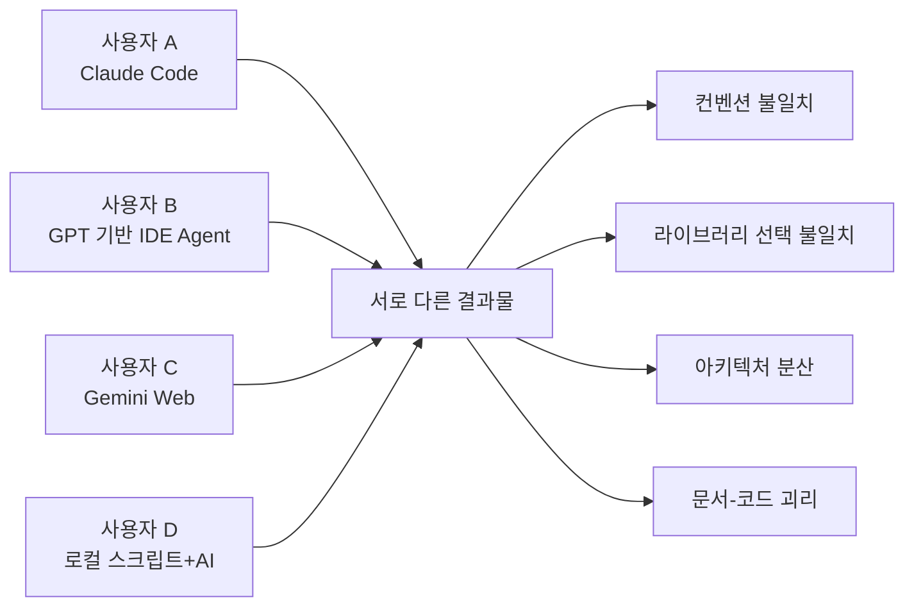
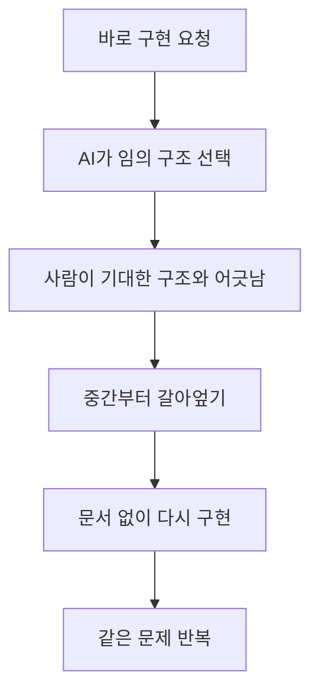
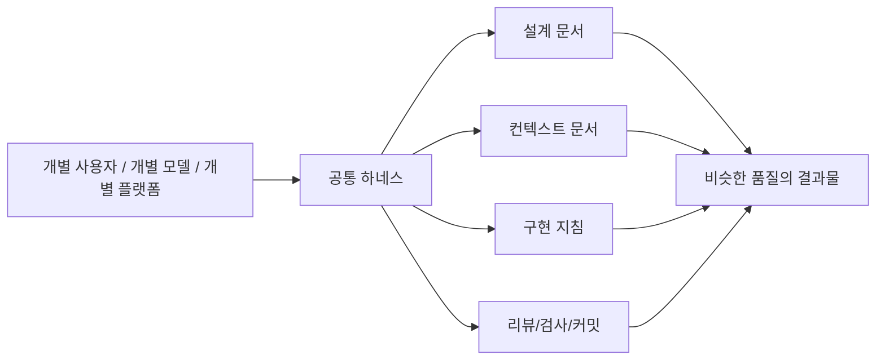
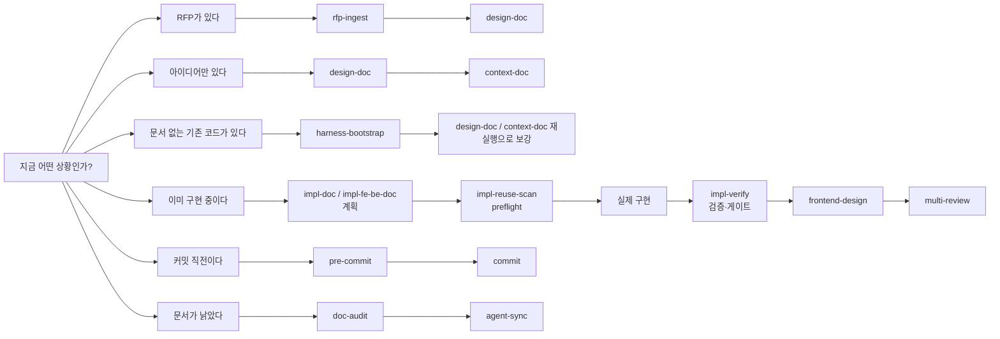
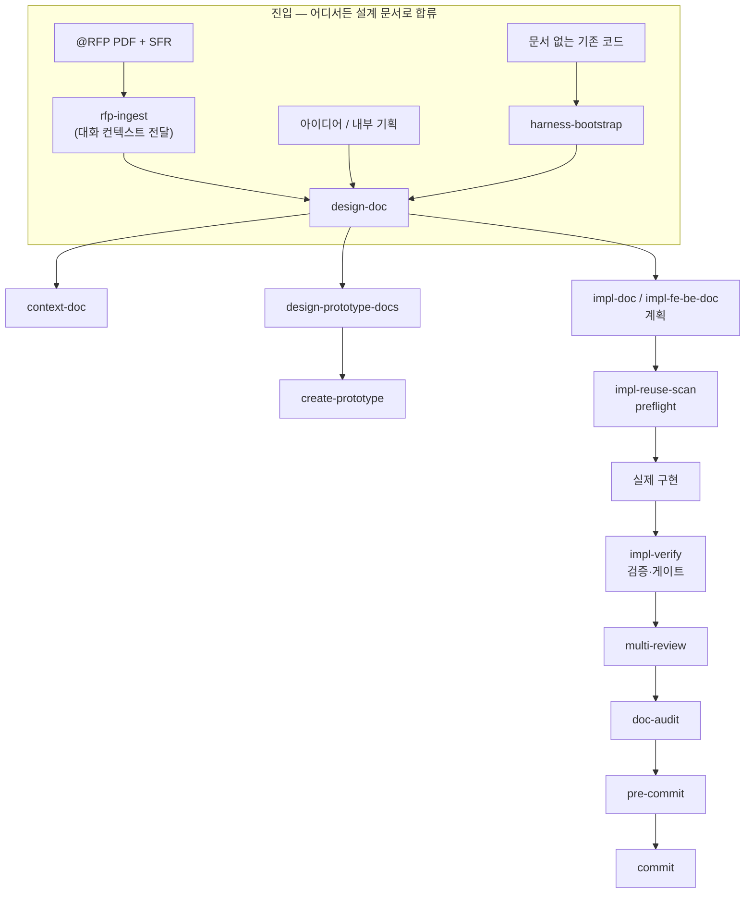
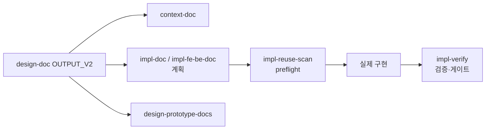

# 왜 스킬셋 같은 것을 구성해서 시작하는지

> AI Agent Harness Engineering 소개 문서  
> 참조 문서: [Harness_Engineering.md](./Harness_Engineering.md)

---

## 이 글을 왜 쓰는가

AI를 팀에서 쓰기 시작하면 처음에는 생산성이 올라가는 것처럼 보인다.  
하지만 시간이 조금만 지나면 다른 문제가 생긴다.

- 어떤 사람은 Claude를 쓰고
- 어떤 사람은 GPT를 쓰고
- 어떤 사람은 Gemini를 쓰고
- 어떤 사람은 IDE Agent를 쓰고
- 어떤 사람은 웹 AI만 쓴다

그리고 각자 다른 방식으로 코드를 만든다.

- 코딩 컨벤션이 사람마다 다르다
- 라이브러리 선택이 다르다
- 공통 모듈을 재사용하는 방식이 다르다
- 아키텍처를 나누는 기준이 다르다
- 주석 스타일이 다르다
- 에러 처리 방식이 다르다
- 문서화 수준이 다르다
- "왜 이렇게 짰는가"가 남지 않는다

결국 AI를 썼는데도 팀의 코드베이스는 더 빨리 흔들린다.

이 문서는 그 문제를 해결하기 위해 작성되었다.  
핵심은 단순하다.

> AI를 잘 쓰는 개인을 만드는 것이 아니라,  
> 서로 다른 사람과 서로 다른 모델이 써도 결과가 크게 흔들리지 않는 공통 작업 하네스를 만드는 것.

이 저장소의 스킬셋은 바로 그 목적을 위해 만들어졌다.

---

## 우리가 해결하려는 문제

### 문제 1. 사람마다 AI 사용 방식이 다르다

같은 기능을 만들어도 결과가 달라진다.



### 문제 2. AI가 항상 프로젝트의 맥락을 기억하지 않는다

AI는 대화창에 들어온 내용, 첨부된 문서, 현재 열려 있는 코드만 보고 판단한다.  
즉, 프로젝트의 공통 규칙이 별도 문서로 구조화되어 있지 않으면 매번 새로 설명해야 한다.

### 문제 3. "바로 구현"은 빠른 것 같지만 보통 더 느리다

설계 없이 AI에게 구현부터 시키면 보통 아래 순서로 무너진다.



### 문제 4. 팀 차원의 재현성이 없다

좋은 결과가 나와도 그것이 **사람의 감**인지, **좋은 프롬프트**인지, **좋은 문서 구조**인지 구분되지 않는다.  
그러면 다음 사람은 같은 품질을 재현할 수 없다.

---

## 그래서 무엇을 하자는 것인가

이 저장소의 접근은 "좋은 프롬프트 몇 줄"이 아니다.  
대신 다음을 고정한다.

1. 설계 문서의 형태
2. Agent가 참조할 컨텍스트 문서의 형태
3. 구현 지침서의 형태
4. 리뷰, 검사, 커밋, 동기화 흐름
5. 하나의 메인 흐름 — RFP·레거시·아이디어 어디서든 같은 파이프라인으로 합류

즉, AI에게 일을 "잘 시키는 말버릇"이 아니라,  
**AI가 흔들리지 않게 만드는 작업 구조**를 만든다.

이를 이 문서에서는 하네스 엔지니어링이라고 부른다.



---

## 이 스킬셋의 핵심 철학

### 1. 설계가 먼저다

AI가 바로 코드부터 쓰게 하지 않는다.  
먼저 무엇을 만들고 왜 그렇게 만드는지 문서로 정리한다.

### 2. Agent가 읽을 고정 맥락을 만든다

루트 가이드 문서(`CLAUDE.md`, `AGENTS.md`)와 주제별로 분리된 `.instruction/*-instruction.md`(아키텍처·코드 스타일·프레임워크·API·통신·파일 생성·Agent 전용 규칙)로 프로젝트의 규칙과 아키텍처를 고정한다.

### 3. 구현은 작은 단위로 쪼갠다

Phase, 화면, 기능, 모듈 같은 단위로 끊는다.  
그래야 AI가 범위를 덜 벗어나고, 중간 검증도 가능하다.

### 4. 문서와 코드는 함께 관리한다

코드가 바뀌면 문서도 갱신돼야 한다.  
그 역할을 `doc-audit`, `agent-sync`가 담당한다.

### 5. 품질 게이트를 앞당긴다

구현 후 바로 리뷰하고, 규칙을 검사하고, 그 다음 커밋한다.

---

## 각 스킬의 역할 소개 및 요약

### 1. 분석·설계·컨텍스트 계열

| 스킬                | 역할                                                                    | 언제 쓰는가                                        |
| ------------------- | ----------------------------------------------------------------------- | -------------------------------------------------- |
| `harness-setup`     | 정본 레포에서 스킬·문서를 프로젝트에 설치·업데이트 + 루트 미관리 파일 관리 | 프로젝트에 하네스를 처음 설치하거나 정본을 업데이트할 때 |
| `rfp-ingest`        | RFP에서 특정 SFR을 뽑아 해석하고 대화 컨텍스트로 전달                    | RFP 기반 프로젝트를 시작할 때                      |
| `design-doc`        | 인터뷰를 통해 구조화된 설계 문서 생성                                   | 아이디어를 실제 작업 문서로 바꿀 때                |
| `context-doc`       | 얇은 루트 가이드 문서(`CLAUDE.md`/`AGENTS.md`) + 주제별 `.instruction/*` 생성 | 설계가 끝나고 Agent가 계속 참고할 기준이 필요할 때 |
| `harness-bootstrap` | 기존 코드베이스 → 설계 문서 + 컨텍스트 문서 역추출                      | 문서가 없는 레거시/기존 프로젝트에 하네스 처음 도입 시 |

### 2. 프로토타입·UI 계열

| 스킬                    | 역할                                                     | 언제 쓰는가                                           |
| ----------------------- | -------------------------------------------------------- | ----------------------------------------------------- |
| `design-prototype-docs` | 화면 설계 문서를 만들어 `create-prototype` 입력으로 사용 | 화면 구성과 정보 배치를 먼저 정리하고 싶을 때         |
| `create-prototype`      | HTML/CSS/JSON 기반의 인터랙티브 프로토타입 생성          | 고객 확인용 목업 또는 화면 감 잡기용 시안이 필요할 때 |
| `frontend-design`       | 흔한 AI 스타일을 피하고 완성도 높은 UI 구현 기준 제공    | 실제 UI/컴포넌트 구현 시                              |

### 3. 구현 지침 계열

| 스킬              | 역할                                    | 언제 쓰는가                                |
| ----------------- | --------------------------------------- | ------------------------------------------ |
| `impl-fe-be-doc`  | FE/BE 페어 다중 기능 또는 RFP/SFR 기반 다중 화면 작업지침서 생성 | 풀스택 다중 기능이나 다중 화면 명세를 끝내야 할 때 |
| `impl-doc`        | 단일·소규모 범용 구현 지침 생성        | BE 단일 기능, FE 단일 기능, CLI, 배치, 라이브러리, 자동화 도구 등일 때 |
| `impl-reuse-scan` | Phase/태스크 시작 직전 공통 자산 발견·보고(자동 반영 금지) | 중복 구현을 피하고 싶을 때 |
| `impl-verify`     | 태스크·Phase 종료 시 검증 매트릭스 산출(코드/지침서 수정 금지) | PASS/FAIL/SKIP 기준으로 다음 Phase 진입 전 점검할 때 |

### 4. 품질·운영 계열

| 스킬           | 역할                                      | 언제 쓰는가                             |
| -------------- | ----------------------------------------- | --------------------------------------- |
| `multi-review` | 보안/성능/유지보수/테스트 4관점 코드 리뷰 | 구현 직후                               |
| `pre-commit`   | 커밋 전 룰 검사                           | 커밋 직전                               |
| `commit`       | Conventional Commits 규칙 기반 커밋       | 스테이징 후                             |
| `code-comment` | 변경 코드에 한글 주석 작성/갱신           | 가독성, 인수인계, 맥락 보강이 필요할 때 |
| `doc-audit`    | 코드와 문서 간 괴리 분석                  | 문서가 낡은 것 같을 때                  |
| `agent-sync`   | Agent 문서/Skills 횡적(lateral) 동기화    | 지침 파일이나 스킬이 바뀌었을 때 (정본 pull은 harness-setup 담당) |
| `git-scoped-account` | 전역 설정 미변경 + 디렉토리 하위 repo들에 git 계정 일괄 적용·확인 | 한 트리 안 여러 repo의 git 계정을 한 번에 맞춰야 할 때 |

### 5. 메타 계열

| 스킬             | 역할                                 | 언제 쓰는가                 |
| ---------------- | ------------------------------------ | --------------------------- |
| `custom-skill-design` | 반복 작업을 새 스킬로 설계·생성·검증 | 같은 워크플로우를 반복할 때 |

---

## 언제 어떤 스킬을 쓰는가



### 빠른 선택 가이드

- 요구사항을 해석하는 중이다 → `rfp-ingest` 또는 `design-doc`
- 설계를 Agent 규칙으로 고정하고 싶다 → `context-doc`
- 문서가 전혀 없는 기존 코드에 하네스를 처음 도입한다 → `harness-bootstrap`
- 화면부터 보고 싶다 → `design-prototype-docs` → `create-prototype`
- 실제 작업 순서를 정하고 싶다 → `impl-*`
- 구현이 끝났다 → `multi-review`
- 커밋할 준비를 한다 → `pre-commit` → `commit`
- 코드와 문서가 안 맞는 느낌이다 → `doc-audit`

---

## 도구별 가이드 문서와 스킬 위치 메모

하네스를 여러 Agent에 걸쳐 쓰다 보면 가장 자주 헷갈리는 것은  
"어떤 파일을 루트 가이드로 두고, 스킬과 커맨드를 어디에 둘 것인가"다.

예전에는 도구별로 `CLAUDE.md`, `AGENTS.md`, `.claude/*`, `.agents/*`를 따로 관리하는 경우가 많았다.
하지만 하네스를 여러 Agent에 공통으로 태우려면 운영 규칙은 더 단순해야 한다.

이 문서에서의 기준은 하나다.  
**재사용 가능한 스킬, 프롬프트, 커맨드 본문, 예시, 실행 스크립트는 모두 `skills/*`를 저장소 단일 원천(source of truth)으로 둔다.**
실무에서는 가능하면 각 도구에서도 이 위치를 그대로 쓰고, 같은 내용을 도구별 폴더에 중복 복사하지 않는다.

즉, 이 문서에서는 아래처럼 운영하는 것을 권장한다.

| 도구 | 주 진입 문서 | 하네스 기준 실제 관리 위치 | 메모 |
| --- | --- | --- | --- |
| Claude Code | `CLAUDE.md` | Claude가 직접 읽는 문서는 `CLAUDE.md`, `.claude/commands/*.md`, `~/.claude/skills/*/SKILL.md`를 따른다. | Claude 네이티브 엔트리는 Claude 방식으로 유지하되, 저장소 원본 스킬은 `skills/*`에 둔다. |
| OpenAI Codex | `AGENTS.md` | 공용 규칙: 루트 `AGENTS.md` / 저장소 원본 스킬: `skills/*/SKILL.md` | Codex 계열은 `AGENTS.md`와 `skills/`를 기준으로 보면 된다. |
| VS Code | 각 확장/에이전트가 읽는 파일명을 그대로 사용 | 확장별 진입 파일이 다르더라도 공용 스킬/커맨드 자산은 `skills/*`를 우선 원본으로 둔다. | VS Code에서는 각 확장이 자기 체계를 읽더라도, 팀이 관리하는 실제 내용은 한 곳에 모아두는 편이 유지보수에 유리하다. |

실무적으로는 이렇게 기억하면 충분하다.

- 팀이 유지보수하는 스킬, 프롬프트, 커맨드 본문, 예시, 스크립트의 원본은 항상 `skills/`에 둔다.
- 설치 대상이 필요한 도구에는 `skills/`의 내용을 `.agents/skills` 또는 `.claude/skills` 같은 대상 경로로 동기화한다.
- 같은 스킬이나 커맨드 본문을 `.agents`, `.claude`, 기타 도구 전용 폴더에 중복 편집하지 않는다.
- Claude처럼 네이티브 경로가 강한 도구는 직접 읽는 엔트리만 해당 도구 규칙을 따르고, 공용 내용의 원본은 가능하면 `skills/`에 한 번만 둔다.

---

## 스킬들 간의 전체 플로우

### 메인 흐름 (단일 통합)

RFP 기반이든 아이디어 기반이든 레거시 부트스트랩이든, 모두 같은 파이프라인으로 합류한다.



### 가장 중요한 연결 관계

이 스킬셋에서 중심 허브는 `design-doc`의 설계 문서다.



즉, 설계 문서가 잘 만들어지면 이후 흐름 전체가 쉬워지고,  
설계 문서가 흔들리면 이후 모든 단계가 흔들린다.

---

## 시작하는 방법

실제 사용은 보통 아래 순서로 시작한다.

0. **하네스 설치**: `/harness-setup`으로 정본 레포에서 스킬·문서를 프로젝트에 설치 (최초 1회 또는 업데이트 시)
1. **슬래시 커맨드처럼 직접 스킬 호출**
2. **`@` 태그와 파일 컨텍스트를 붙여 더 디테일하게 요청**
3. **기존 코드베이스 → 하네스 부팅**: `/harness-bootstrap`으로 레거시 프로젝트에 처음 하네스 도입

환경에 따라 호출 문법은 조금 다를 수 있지만, 실전에서는 아래 패턴으로 이해하면 된다.

### 방식 1. `/` 로 직접 시작

가장 단순한 방식이다.

```text
/design-doc
/context-doc
/impl-fe-be-doc
/impl-reuse-scan
/impl-verify
/multi-review
/pre-commit
/commit
```

이 방식은 "지금 어떤 스킬을 쓸지 내가 이미 알고 있다"는 전제에서 가장 빠르다.

```text
/impl-fe-be-doc
↓
/impl-reuse-scan   ← Phase 시작 전 (선택)
↓ 구현
/impl-verify       ← Phase 종료 시
```

### 방식 2. `@` 로 파일을 붙이고 구체적으로 요청

RFP, 설계 문서, 기존 코드 파일, 예시 문서를 함께 묶어서 주는 방식이다.

```text
@D:\Dev_Workspace\pre_working\프로젝트명\제안요청서.pdf
/rfp-ingest SFR-019,SFR-021
```

```text
@./설계문서.md
/context-doc
```

```text
@./example/Acro.md
/design-doc

(rfp-ingest 결과는 대화 컨텍스트로 이미 전달되어 있으므로 별도 파일 첨부 불필요)
```

### 방식 3. 스킬명 + 범위 + 참조문서 + 금지범위까지 같이 적기

가장 실무적인 방식이다.

```text
@./CLAUDE.md
@./.instruction/basic-instruction.md
@./.docs/impl-doc/{사용자}/{기능명}.md

/impl-fe-be-doc 결과를 기준으로
Phase 2의 FE-03 태스크만 구현해줘.
수정 파일은 app/dashboard/page.tsx, components/summary-card.tsx 로 제한.
다른 Phase나 공통 레이아웃은 건드리지 말 것.
완료 후 검증 포인트도 함께 적어줘.
```

Phase 시작 전 `/impl-reuse-scan`, Phase 종료 후 `/impl-verify`를 함께 쓰는 흐름을 권장합니다.

이 방식이 좋은 이유는 AI에게 아래 네 가지를 동시에 주기 때문이다.

- 무엇을 참고해야 하는지
- 이번 턴 범위가 어디까지인지
- 어디를 건드리면 안 되는지
- 완료 기준이 무엇인지

---

## 조금 더 디테일한 프롬프팅 예시

### 예시 1. 아이디어에서 설계 문서로

```text
/design-doc

관리자가 문서 업로드 후 AI 요약과 태깅을 할 수 있는 기능을 설계하고 싶어.
이건 기존 운영 포털 안의 기능 단위 작업이야.
관련된 기존 모듈은 admin/documents, shared/upload, shared/ai-client 야.
기존 패턴은 React + Spring Boot + PostgreSQL 조합을 유지해야 해.
업로드 후 상태 추적, 실패 재시도, 권한 체크까지 고려해서 인터뷰 진행해줘.
```

### 예시 2. RFP에서 특정 SFR만 시작

```text
@D:\Dev_Workspace\pre_working\sample\제안요청서_v2.pdf
/rfp-ingest SFR-019
```

추가로 더 좋게 쓰려면 이렇게 쓸 수 있다.

```text
@D:\Dev_Workspace\pre_working\sample\제안요청서_v2.pdf
/rfp-ingest SFR-019

분석할 때 화면 후보, 주요 액션, 입력/출력, 예외 케이스를 같이 정리해줘.
애매한 부분이 있으면 최대 5개 이내로 한 번에 질문해줘.
```

### 예시 3. 설계 문서를 Agent 규칙으로 고정

```text
@./설계문서.md
/context-doc

금지 패턴은 "패턴 + 이유 + 대안" 형태로 강하게 정리해줘.
이 프로젝트는 공통 API 래퍼와 공통 에러 핸들러를 반드시 써야 해.
```

### 예시 4. 화면 먼저 보기

```text
@./설계문서.md
/design-prototype-docs

관리자 대시보드, 작업 목록, 상세 패널 기준으로 화면 분리해줘.
기능 배치 이유와 화면 간 이동 흐름도 같이 넣어줘.
메인 컬러는 네이비 계열로 잡아줘.
```

```text
@./SFR-020_목업디자인.md
/create-prototype
```

### 예시 5. 웹앱용 구현 지침 생성

```text
@./설계문서.md
/impl-fe-be-doc

FE와 BE가 한 Phase 안에서 같이 검증 가능하도록 쪼개줘.
각 Phase 끝에 사람이 직접 확인할 수 있는 결과가 있어야 해.
API가 너무 많은 Phase는 쪼개줘.
```

Phase 시작 전 `/impl-reuse-scan`, Phase 종료 후 `/impl-verify`를 함께 쓰는 흐름을 권장합니다.

### 예시 6. 커밋 전 품질 게이트

```text
/multi-review
/pre-commit
/commit
```

또는 이렇게 더 명확하게 쓸 수 있다.

```text
/multi-review
현재 변경 파일 기준으로 리뷰해줘.
보안/성능/테스트 누락을 우선순위 높게 봐줘.
```

---

## 좋은 사용 습관

### 1. 한 번에 너무 큰 범위를 시키지 않는다

나쁜 예:

```text
로그인, 회원가입, 관리자 대시보드, API 연동까지 다 만들어줘.
```

좋은 예:

```text
@./.docs/impl-doc/{사용자}/{기능명}.md
Phase 1의 BE-02와 FE-02만 진행해줘.
다른 Phase는 건드리지 말 것.
```

Phase 시작 전 `/impl-reuse-scan`, Phase 종료 후 `/impl-verify`를 함께 쓰는 흐름을 권장합니다.

### 2. 참조 문서를 먼저 붙인다

좋은 결과는 보통 문서에서 나온다.

- 설계 문서
- `CLAUDE.md`
- `basic-instruction.md`
- 구현 지침서
- RFP 분석 결과

이 문서들을 먼저 주고 작업 범위를 나중에 주는 편이 낫다.

### 3. 완료 기준을 같이 적는다

단순히 "구현해줘"보다 아래가 훨씬 좋다.

```text
구현 후 아래를 함께 보고해줘.
- 어떤 파일을 수정했는지
- 검증은 무엇을 했는지
- 남아 있는 위험은 무엇인지
```

### 4. 문서 갱신을 미루지 않는다

구조가 바뀌었는데 `CLAUDE.md`가 예전 상태면, 다음 Agent는 낡은 규칙을 믿고 또 잘못 구현한다.  
이때 바로 `doc-audit`를 써야 한다.

---

## 팀 관점에서 이 스킬셋이 주는 효과


### 기대 효과

- 모델이 달라도 결과 편차가 줄어든다
- 신규 인원이 들어와도 온보딩이 쉬워진다
- "왜 이렇게 만들었는가"가 문서로 남는다
- 코드와 문서가 함께 움직이게 된다
- 리뷰 기준이 통일된다
- 공통 모듈과 공통 패턴 재사용률이 올라간다
- AI 활용이 개인기에서 팀 시스템으로 바뀐다

---

## 추천하는 최초 도입 순서

처음부터 모든 스킬을 다 쓰려고 하지 않는 편이 좋다.

### 0단계. 설치

- `harness-setup` (정본 레포에서 스킬·문서를 프로젝트에 설치)
- `git-scoped-account` (복수 앱 프로젝트에서 하위 repo git 계정 일괄 적용 시)

### 1단계. 최소 도입

- `design-doc`
- `context-doc`
- `harness-bootstrap` (문서 없는 기존 코드베이스에 진입할 때)
- `impl-fe-be-doc` 또는 `impl-doc`
- `impl-reuse-scan`
- `impl-verify`
- `multi-review`
- `pre-commit`

### 2단계. 화면/제안 흐름 확장

- `design-prototype-docs`
- `create-prototype`
- `frontend-design`
- `rfp-ingest`

### 3단계. 운영 안정화

- `doc-audit`
- `agent-sync`
- `code-comment`

### 4단계. 반복 업무 자동화

- `custom-skill-design`

---

## 마지막으로

이 스킬셋은 "AI를 더 똑똑하게 쓰는 방법"만을 말하는 문서가 아니다.  
그보다 더 중요한 것을 목표로 한다.

> 누가 어떤 모델을 쓰더라도  
> 팀의 공통 규칙, 공통 아키텍처, 공통 문서, 공통 품질 기준 위에서  
> 비슷한 품질의 결과를 반복해서 만들어내는 것.

AI를 각자 쓰면 결과는 빨라질 수 있지만, 팀은 쉽게 흩어진다.  
반대로 하네스가 있으면, AI 사용이 개인의 취향이 아니라 팀의 생산 체계가 된다.

이 문서는 그 시작점으로 읽히길 기대한다.  
세부 운영 기준과 최신 스킬 맵은 반드시 [Harness_Engineering.md](./Harness_Engineering.md)를 함께 참고하면 된다.
